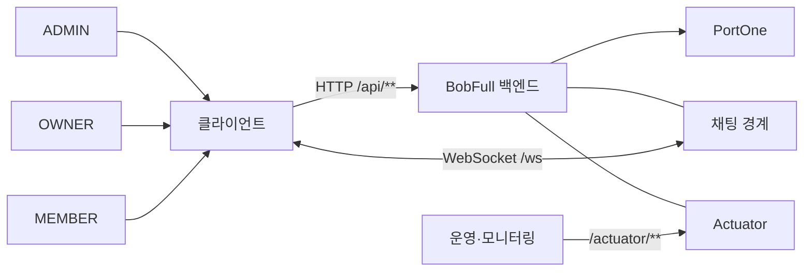
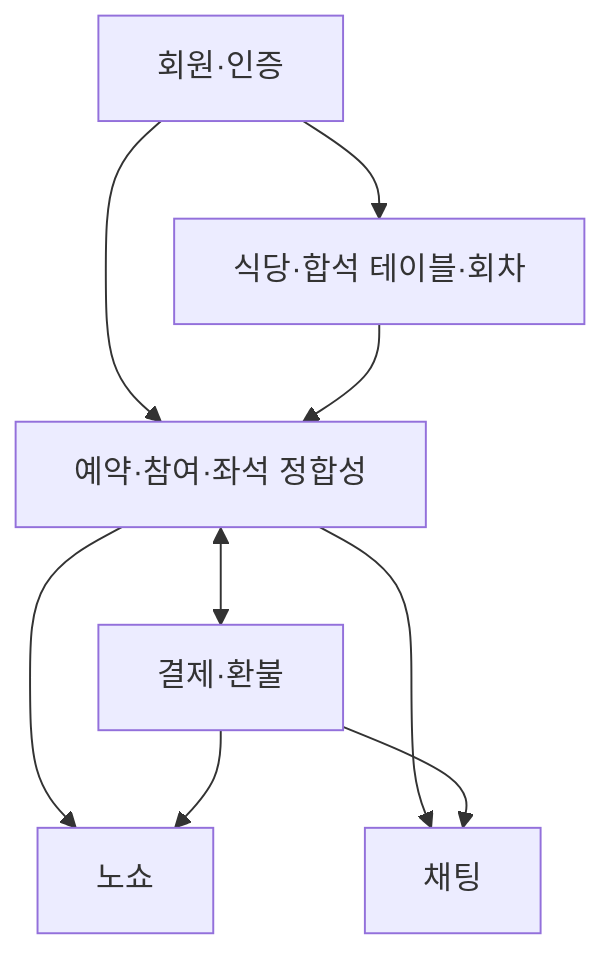
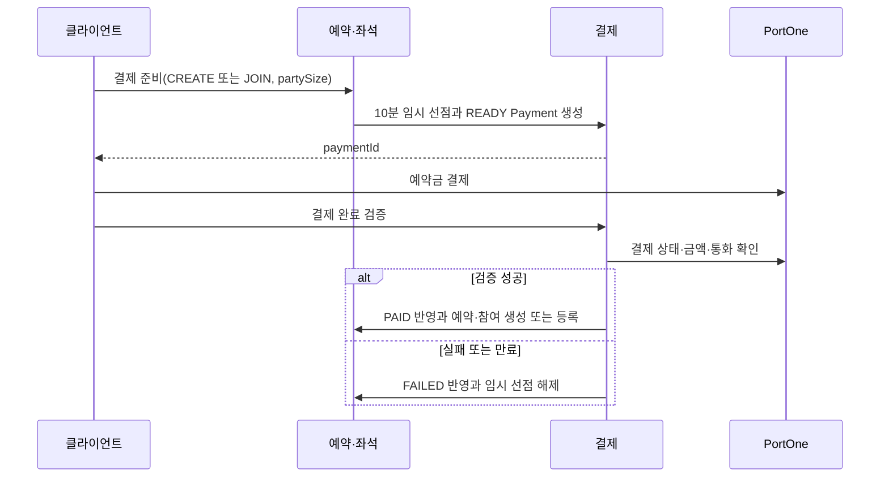

# BobFull 논리 아키텍처

## 1. 목적과 기준

이 문서는 확정된 서비스 계약을 논리 구성 요소와 책임의 관점에서 연결한다. 새 정책이나 기술 선택을 결정하지 않으며, 상세 HTTP 계약과 ERD 컬럼은 원본 문서를 따른다.

기준 문서 우선순위는 다음과 같다.

1. [API 명세](./BOBFULL_API_SPEC_COMPLETE.md): HTTP·WebSocket·Actuator 계약
2. [프로젝트 컨텍스트](./PROJECT_CONTEXT.md): 서비스 정책·역할·버전 범위
3. [ERD](./ERD.md): 영속 데이터·관계·저장값과 계산값

세 문서가 충돌하면 이 문서에서 해석하거나 정책을 정하지 않고 작업을 중단해 Human 판단을 요청한다.

## 2. 시스템 컨텍스트와 경계



- `MEMBER`는 사용자 조회, 본인 예약·참여·결제·환불 조회와 결제 준비를 수행한다.
- `OWNER`는 본인 식당·합석 테이블·회차와 해당 식당의 예약 정보를 관리한다.
- `ADMIN`은 V2의 운영 조회와 V3의 재처리·재집계 범위를 가진다.
- 일반 서비스 HTTP API는 `/api/**`, OWNER·ADMIN 경계는 각각 `/api/owner`, `/api/admin`이다. 채팅 연결은 `/ws`, 운영 상태·모니터링은 `/actuator/**` 경계에 둔다.
- PortOne은 결제 완료 검증과 웹훅 처리의 외부 결제 시스템이다.

## 3. 논리 구성 요소와 의존 관계



| 구성 요소 | 책임 | 기준 데이터·경계 |
|---|---|---|
| 회원·인증 | 역할 식별, 인증 사용자와 본인 리소스 연결 | `Member`, `MEMBER`·`OWNER`·`ADMIN` |
| 식당·합석 테이블·회차 | OWNER 소유 식당, 정원, 예약 가능한 회차 관리 | `Restaurant`, `SharedTable`, `TimeSlot` |
| 예약·참여·좌석 정합성 | 최초 예약·추가 참여, 참여 인원·모집·예약 상태 계산 | `Reservation`, `ReservationParticipant`, `TimeSlot` |
| 결제·환불 | 임시 선점, PortOne 검증, 결제·환불 상태 반영 | `Payment`, `Refund` |
| 노쇼 | 식사 종료 후 OWNER의 참여자 단위 처리·해제 이력 | `NoShowHistory` |
| 채팅 | 예약당 채팅방, 유효 참여자 접근, 메시지 저장·조회 | `ChatRoom`, `ChatMessage` |

## 4. 인증·인가와 소유권 검증

역할 검증만으로 타인 리소스 접근을 허용하지 않는다. MEMBER의 결제 완료 검증은 인증 사용자와 `Payment.memberId`가 일치해야 하며, OWNER는 본인 식당의 식당·테이블·회차·예약만 관리한다. ADMIN 범위는 문서에 명시된 운영 조회·재처리로 제한한다.

PortOne 웹훅은 사용자 인증이 아닌 서명 검증으로 처리한다. 완료 검증 API와 웹훅이 동시에 도착하더라도 결제, 예약, 참여 상태는 한 번만 반영해야 한다. 상세 권한별 API와 오류 계약은 [API 명세](./BOBFULL_API_SPEC_COMPLETE.md)를 따른다.

## 5. 예약·좌석·결제 처리



`PaymentStatus.READY`는 별도 좌석 선점 엔티티 없이 10분 임시 선점을 표현한다. 결제 성공 전에는 `Reservation` 또는 `ReservationParticipant`를 생성하지 않는다.

남은 참여 가능 인원은 저장값이 아니라 다음 원천 데이터로 계산한다.

```text
currentParticipantCount = PAID 상태 유효 참여자의 partySize 합계
temporaryHoldCount = 만료되지 않은 READY 결제의 partySize 합계
availableCapacity = capacity - currentParticipantCount - temporaryHoldCount
```

동일 TimeSlot의 새 최초 예약 또는 READY Payment 생성은 TimeSlot 행을 잠그고 활성 예약을 확인하는 정합성 경계가 된다. 구체적인 락 구현과 트랜잭션 세부사항은 별도 구현 Issue에서 확정한다.

## 6. 취소·환불·노쇼

- MEMBER 취소는 식사 시작 2시간 전까지 본인 참여 전체 단위로만 가능하다. 최초 예약자 취소는 예약 전체 취소와 유효 참여자 전액 환불로 이어지고, 추가 참여자 취소는 본인 참여와 본인 Payment 전체 환불을 처리한다.
- 모집 마감·수동 마감 이후 확정 기준 미달 또는 OWNER·시스템 귀책으로 진행할 수 없는 예약은 전체 취소와 전액 환불 대상이다. 환불 완료 시 `RefundStatus.COMPLETED`와 `PaymentStatus.CANCELLED`를 함께 반영한다.
- OWNER는 식사 종료 후 `RESERVED` 참여자를 노쇼 처리·해제하며, `NoShowHistory`에 처리 이력을 남긴다. 노쇼는 취소나 환불을 대신하지 않는다.

예약 상태·모집 상태 전이와 TimeSlot 재사용 조건은 [프로젝트 컨텍스트](./PROJECT_CONTEXT.md)를, 환불과 노쇼의 데이터 관계는 [ERD](./ERD.md)를 따른다.

## 7. 채팅

최초 예약 결제가 완료되면 예약당 `ChatRoom` 하나를 생성한다. 결제 완료 후 취소되지 않은 유효 참여자만 접근할 수 있고 OWNER와 ADMIN은 참여하지 않는다. 예약 또는 참여가 취소되면 해당 참여자의 접근은 종료되며, 예약이 `CANCELLED` 또는 `CLOSED`가 되면 새 메시지 전송을 종료한다. 기존 `ChatMessage`는 DB에 보관하고 cursor 기반으로 조회한다.

STOMP 전송·구독 경로와 HTTP 메시지 조회의 상세 계약은 [API 명세](./BOBFULL_API_SPEC_COMPLETE.md)를 참조한다.

## 8. 저장값·계산값과 운영 관찰

ERD에 정의된 엔티티는 관계와 상태 이력을 저장한다. 반면 예약 상세의 `currentParticipantCount`, `availableCapacity`, `confirmationThreshold`와 지급 예정 예약금은 원천 데이터에서 계산해 제공한다. 응답 계산값을 별도 컬럼으로 중복 저장하지 않는다.

API 명세의 운영 요구사항은 요청 ID(MDC), 인증 사용자 ID, API 경로·Method, HTTP 응답 상태, 처리 시간, 오류 코드, 예약·결제·환불·노쇼 처리 결과 기록을 포함한다. 비밀번호, 토큰, 결제키는 로그에서 제외한다. Actuator의 health·Prometheus 경계는 V3 범위다.

## 9. 제외·보류 항목

다음 항목은 기준 문서에서 확정되지 않았거나 이번 문서 범위가 아니므로 구조를 구체화하지 않는다.

- 배포 구조, 최종 AWS 구성, 프론트엔드 배포 방식, V1·V2·V3별 물리 아키텍처
- Redis·Kafka 도입 구조와 채팅 Pub/Sub
- 구체적인 락 구현체와 트랜잭션 경계
- `Settlement`, `SeatHold`, `WebhookEvent` 같은 신규 엔티티
- 개별 ADR의 사전 생성, API·ERD 상세 복제, 클래스·패키지 구조

새 기술 선택이나 중요한 구조 변경이 실제로 필요해지면 [ADR 운영 기준](./adr/README.md)에 따라 별도 ADR을 작성한다.

## 10. 관련 문서

- [프로젝트 컨텍스트](./PROJECT_CONTEXT.md)
- [전체 API 명세](./BOBFULL_API_SPEC_COMPLETE.md)
- [ERD](./ERD.md)
- [도메인 의존성과 변경 영향](./DOMAIN_DEPENDENCIES.md)
- [ADR 운영 기준](./adr/README.md)
