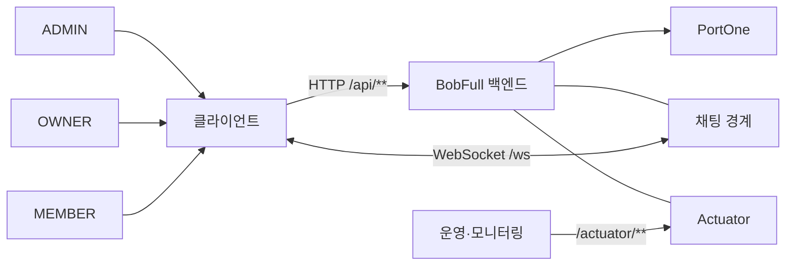
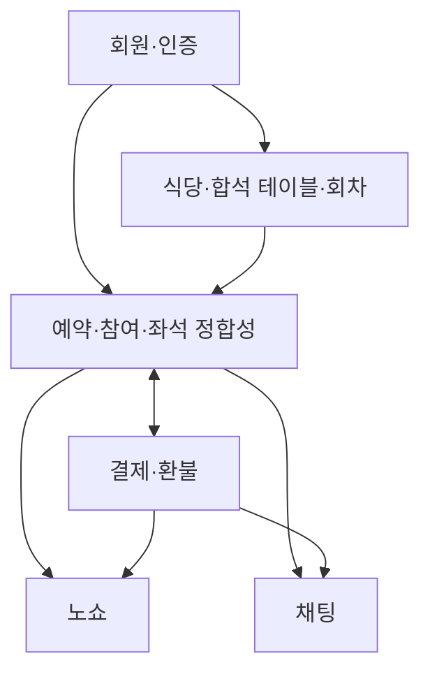

# BobFull 논리 아키텍처

## 1. 목적과 기준

이 문서는 확정된 서비스 계약을 논리 구성 요소와 책임의 관점에서 연결한다. 새 정책이나 기술 선택을 결정하지 않으며, 상세 HTTP 계약과 ERD 컬럼은 원본 문서를 따른다.

기준 문서 우선순위는 다음과 같다.

1. [API 명세](./BOBFULL_API_SPEC_COMPLETE.md): HTTP·WebSocket·Actuator 계약
2. [프로젝트 컨텍스트](./PROJECT_CONTEXT.md): 서비스 정책·역할·버전 범위
3. [ERD](./ERD.md): 영속 데이터·관계·저장값과 계산값

세 문서가 충돌하면 이 문서에서 해석하거나 정책을 정하지 않고 작업을 중단해 Human 판단을 요청한다.

## 2. 시스템 컨텍스트와 경계

```mermaid
flowchart LR
    member["MEMBER"] --> client["클라이언트"]
    owner["OWNER"] --> client
    admin["ADMIN"] --> client

    client -->|"HTTP /api/**"| api["BobFull 백엔드"]
    client <-->|"WebSocket /ws"| chat["채팅 경계"]
    api --> payment["PortOne"]
    ops["운영·모니터링"] -->|"/actuator/**"| actuator["Actuator"]

    api --- chat
    api --- actuator
```

- `MEMBER`는 사용자 조회, 본인 예약·참여·결제·환불 조회와 결제 준비를 수행한다.
- `OWNER`는 본인 식당·합석 테이블·회차와 해당 식당의 예약 정보를 관리한다.
- `ADMIN`은 V2의 운영 조회와 V3의 재처리·재집계 범위를 가진다.
- 일반 서비스 HTTP API는 `/api/**`, OWNER·ADMIN 경계는 각각 `/api/owner`, `/api/admin`이다. 채팅 연결은 `/ws`, 운영 상태·모니터링은 `/actuator/**` 경계에 둔다.
- PortOne은 결제 완료 검증과 웹훅 처리의 외부 결제 시스템이다.

## 3. 논리 구성 요소와 의존 관계

```mermaid
flowchart TB
    auth["회원·인증"]
    restaurant["식당·합석 테이블·회차"]
    reservation["예약·참여·좌석 정합성"]
    payment["결제·환불"]
    noshow["노쇼"]
    chat["채팅"]

    auth --> restaurant
    auth --> reservation
    restaurant --> reservation
    reservation <--> payment
    reservation --> noshow
    payment --> noshow
    reservation --> chat
    payment --> chat
```

| 구성 요소 | 책임 | 기준 데이터·경계 |
|---|---|---|
| 회원·인증 | 역할 식별, 인증 사용자와 본인 리소스 연결 | `Member`, `MEMBER`·`OWNER`·`ADMIN` |
| 식당·합석 테이블·회차 | OWNER 소유 식당, 정원, 예약 가능한 회차 관리 | `Restaurant`, `SharedTable`, `TimeSlot` |
| 예약·참여·좌석 정합성 | 최초 예약·추가 참여, 참여 인원·모집·예약 상태 계산 | `Reservation`, `ReservationParticipant`, `TimeSlot` |
| 결제·환불 | 임시 선점, PortOne 검증, 결제·환불 상태 반영 | `Payment`, `Refund` |
| 노쇼 | 식사 종료 후 OWNER의 참여자 단위 처리·해제 이력 | `NoShowHistory` |
| 채팅 | 예약당 채팅방, 유효 참여자 접근, 메시지 저장·조회 | `ChatRoom`, `ChatMessage` |

## 4. 인증·인가와 소유권 검증

역할 검증만으로 타인 리소스 접근을 허용하지 않는다. MEMBER의 결제 완료 검증은 인증 사용자와 `Payment.memberId`가 일치해야 하며, OWNER는 본인 식당의 식당·테이블·회차·예약만 관리한다. ADMIN 범위는 문서에 명시된 운영 조회·재처리로 제한한다.

PortOne 웹훅은 `POST /api/webhooks/portone`을 `permitAll`·JWT 필터 제외로 열되, 사용자 인증 대신 원본 Body와 `webhook-id`·`webhook-signature`·`webhook-timestamp`의 공식 SDK 서명 검증을 수행한다. JSON 해석은 검증 뒤에만 허용한다. 완료 검증 API와 웹훅은 입구 검증만 분리하고 PortOne 재조회, 동일 Payment 행 비관적 락, 상태·만료 재검증, 예약 확정을 공통 처리로 수렴한다.

### 인증 세션(Access·Refresh Token)

Access Token은 HS256 JWT로 서명·만료만 검증하는 무상태 토큰이며 서버에 상태를 저장하지 않는다. Refresh Token은 발급·재발급·로그아웃의 폐기가 가능해야 하므로 Redis에만 저장한다(DB 테이블 아님, `docs/CODE_CONVENTION.md` 기준). 회원당 Refresh Token은 항상 1건이며, 로그인·재발급마다 기존 키를 지우고 새로 발급한다(회전). 로그아웃은 인증된 memberId로 그 회원의 Refresh Token 키를 즉시 삭제한다. Redis 조회 실패는 재발급을 401로 거부하고(fail-closed), 로그아웃의 Redis 실패는 감추지 않고 그대로 전파한다. Access Token Blacklist(요청마다 Redis 조회)는 도입하지 않으며, Refresh Token 재사용 탐지(탈취 시 전체 세션 무효화)도 아직 도입하지 않는다 — ADMIN 역할처럼 탈취 시 위험도가 높은 대상이 추가되면 별도 Issue로 재검토한다(`docs/adr/0006-refresh-token-redis.md`).

## 5. 예약·좌석·결제 처리

```mermaid
sequenceDiagram
    participant C as 클라이언트
    participant R as 예약·좌석
    participant P as 결제
    participant O as PortOne

    C->>R: 결제 준비(CREATE 또는 JOIN, partySize)
    R->>P: 10분 임시 선점과 READY Payment 생성
    P-->>C: paymentId
    C->>O: 예약금 결제
    C->>P: 결제 완료 검증
    P->>O: 결제 상태·금액·통화 재조회
    P->>P: Payment 내부 PK 비관적 락·상태/만료 재검증
    alt 검증 성공
        P->>R: 단일 트랜잭션으로 PAID 반영과 예약·참여 생성 또는 등록
    else 실패 또는 만료
        P->>R: 검증 실패는 FAILED, 시간 만료는 EXPIRED; 좌석은 expiresAt로 즉시 반환
    end
```

`PaymentStatus.READY`는 별도 좌석 선점 엔티티 없이 임시 선점을 표현하며, 결제 성공 전에는 `Reservation` 또는 `ReservationParticipant`를 생성하지 않는다. `expiresAt > now`인 READY만 좌석 계산에 포함하므로 만료 좌석은 스케줄러 실행 전에도 반환된다. 만료 스케줄러는 `fixedDelay=60s`, 배치 100건으로 `(payment_status, expires_at, payment_id)` 인덱스를 사용해 내부 PK 후보를 조회하고, 건별 트랜잭션·같은 Payment 행 락에서 EXPIRED만 정규화한다.

## 6. 취소·환불·노쇼

- MEMBER·OWNER 취소와 환불은 예약·참여·결제 상태를 함께 반영하는 경계다.
- OWNER는 식사 종료 후 `RESERVED` 참여자를 노쇼 처리·해제하며, `NoShowHistory`에 처리 이력을 남긴다. 노쇼는 취소나 환불을 대신하지 않는다.

취소 가능 시점, 전체·참여자 단위 환불, 상태 전이와 TimeSlot 재사용 조건은 [프로젝트 컨텍스트](./PROJECT_CONTEXT.md)와 [API 명세](./BOBFULL_API_SPEC_COMPLETE.md)를, 환불·노쇼 데이터 관계는 [ERD](./ERD.md)를 따른다.

## 7. 채팅

최초 예약 결제가 완료되면 예약당 `ChatRoom` 하나를 생성한다. 결제 완료 후 취소되지 않은 유효 참여자만 접근할 수 있고 OWNER와 ADMIN은 참여하지 않는다. 예약 또는 참여가 취소되면 해당 참여자의 접근은 종료되며, 예약이 `CANCELLED` 또는 `CLOSED`가 되면 새 메시지 전송을 종료한다. 기존 `ChatMessage`는 DB에 보관하고 cursor 기반으로 조회한다.

STOMP 전송·구독 경로와 HTTP 메시지 조회의 상세 계약은 [API 명세](./BOBFULL_API_SPEC_COMPLETE.md)를 참조한다.

## 8. 저장값·계산값과 운영 관찰

ERD에 정의된 엔티티는 관계와 상태 이력을 저장한다. 반면 예약 상세의 `currentParticipantCount`, `availableCapacity`, `confirmationThreshold`와 지급 예정 예약금은 원천 데이터에서 계산해 제공한다. 응답 계산값을 별도 컬럼으로 중복 저장하지 않는다.

API 명세의 운영 요구사항은 요청 ID(MDC), 인증 사용자 ID, API 경로·Method, HTTP 응답 상태, 처리 시간, 오류 코드, 예약·결제·환불·노쇼 처리 결과 기록을 포함한다. 비밀번호, 토큰, 결제키는 로그에서 제외한다. Actuator의 health·Prometheus 경계는 V3 범위다.

외부 결제가 PAID인데 내부 Payment가 `EXPIRED` 또는 만료 READY면 `event=PAYMENT_COMPENSATION_REQUIRED`와 `paymentId`, `externalStatus`, `internalStatus`, `expiresAt`, `reason`을 기록한다. 웹훅은 이 영구 업무 실패를 200으로 확인하지만 PortOne 네트워크·DB·예상하지 못한 오류는 5xx로 둔다. 자동 취소·환불·보상 트랜잭션과 `WebhookEvent` 저장은 이번 범위에서 제외한다.

## 9. 제외·보류 항목

다음 항목은 기준 문서에서 확정되지 않았거나 이번 문서 범위가 아니므로 구조를 구체화하지 않는다.

- 배포 구조, 최종 AWS 구성, 프론트엔드 배포 방식, V1·V2·V3별 물리 아키텍처
- Redis의 배포·클러스터 구성(로컬 단일 인스턴스만 구성됨), Kafka 도입 구조, 채팅 Pub/Sub
- Access Token Blacklist, Refresh Token 재사용 탐지(§4 인증 세션 참고)
- 구체적인 락 구현체와 트랜잭션 경계
- `Settlement`, `SeatHold`, `WebhookEvent` 같은 신규 엔티티
- 개별 ADR의 사전 생성, API·ERD 상세 복제, 클래스·패키지 구조

새 기술 선택이나 중요한 구조 변경이 실제로 필요해지면 [ADR 운영 기준](./adr/README.md)에 따라 별도 ADR을 작성한다.

## 10. 관련 문서

- [프로젝트 컨텍스트](./PROJECT_CONTEXT.md)
- [전체 API 명세](./BOBFULL_API_SPEC_COMPLETE.md)
- [ERD](./ERD.md)
- [도메인 의존성과 변경 영향](./DOMAIN_DEPENDENCIES.md)
- [ADR 운영 기준](./adr/README.md)
