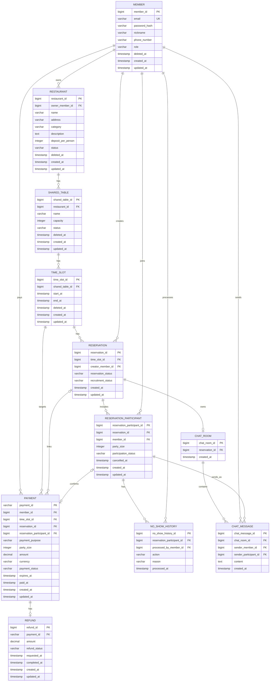

# BobFull ERD

## 1. 문서 목적과 기준

이 문서는 확정된 API와 프로젝트 정책을 구현 가능한 관계형 데이터 모델로 표현한다.

- 기준: [`BOBFULL_API_SPEC_COMPLETE.md`](./BOBFULL_API_SPEC_COMPLETE.md), [`PROJECT_CONTEXT.md`](./PROJECT_CONTEXT.md)
- 범위: V1 예약·결제·환불 조회와 V2 취소·노쇼·채팅·운영 조회에 필요한 영속 데이터
- 비범위: Java Entity, Migration, SQL Schema, Redis, Kafka, 실제 계좌 송금
- 원칙: API Response DTO를 테이블로 만들지 않고, 기준 문서에 없는 정책은 확정하지 않는다. Mermaid의 표현 한계가 있으면 아래 엔티티 상세 표를 기준으로 한다.

## 2. 핵심 데이터 모델 요약

| 엔티티 | 목적 | 주요 관계 | V1·V2·V3 |
|---|---|---|---|
| `Member` | 인증 사용자와 역할 | 식당 소유자, 예약 생성자, 참여자, 결제자, 메시지 발신자 | V1 |
| `Restaurant` | OWNER의 식당 | Member 1:N Restaurant | V1 |
| `SharedTable` | 식당의 합석 테이블·정원 | Restaurant 1:N SharedTable | V1 |
| `TimeSlot` | 테이블별 예약 가능 회차 | SharedTable 1:N TimeSlot | V1 |
| `Reservation` | 회차의 합석 예약과 취소 이력 | TimeSlot 1:N Reservation, 활성 예약은 1건 | V1 |
| `ReservationParticipant` | 사용자별 신청 인원·참여 상태 | Reservation과 Member의 연결 | V1 |
| `Payment` | READY 임시 선점·PortOne 결제 | Member·TimeSlot·Reservation/Participant 연결 | V1 |
| `Refund` | 결제 전체 단위 환불 상태 | Payment 1:0..1 Refund | V1/V2 |
| `NoShowHistory` | OWNER의 노쇼 처리·해제 이력 | ReservationParticipant 1:N NoShowHistory | V2 |
| `ChatRoom` | 예약당 하나의 채팅방 | Reservation 1:0..1 ChatRoom | V2 |
| `ChatMessage` | DB에 저장되는 채팅 메시지 | ChatRoom 1:N ChatMessage | V2 |

관리자 현황·통계와 지급 예정 예약금은 위 데이터의 조회·집계로 제공한다. 별도 `Settlement`, `SeatHold`, `WebhookEvent`, 관리자 전용 엔티티는 현재 계약에 추가하지 않는다.

## 3. Mermaid ERD

## 4. 엔티티 상세

모든 Enum 표기는 애플리케이션 Enum 값이다. MySQL `ENUM` 타입 사용을 확정하지 않는다.

### 4.1 `member`

목적: 인증 사용자와 `MEMBER`·`OWNER`·`ADMIN` 역할을 보관한다.

| 컬럼 | 타입 후보 | NULL | Key·제약 | 설명 |
|---|---|---:|---|---|
| `member_id` | BIGINT | N | PK | 내부 식별자 |
| `email` | VARCHAR | N | UNIQUE | 로그인 식별자 |
| `password_hash` | VARCHAR | N |  | 비밀번호 해시 |
| `nickname` | VARCHAR | N |  | 참여자 목록·채팅 표시 이름 |
| `phone_number` | VARCHAR | N |  | 회원 정보 |
| `role` | VARCHAR | N | 앱 Enum: `MEMBER`, `OWNER`, `ADMIN` | 역할 |
| `deleted_at` | TIMESTAMP | Y |  | 회원 탈퇴 처리 방식은 보류 |
| `created_at`, `updated_at` | TIMESTAMP | N |  | 생성·수정 시각 |

### 4.2 `restaurant`

목적: OWNER가 소유·관리하는 식당이다.

| 컬럼 | 타입 후보 | NULL | Key·제약 | 설명 |
|---|---|---:|---|---|
| `restaurant_id` | BIGINT | N | PK | 식당 식별자 |
| `owner_member_id` | BIGINT | N | FK → `member.member_id`, INDEX | OWNER 소유자 |
| `name`, `address`, `category` | VARCHAR | N |  | 식당 기본 정보 |
| `description` | TEXT | N |  | 식당 소개 |
| `deposit_per_person` | DECIMAL | N |  | 1인당 예약금 |
| `status` | VARCHAR | N | 앱 Enum: 현재 `ACTIVE` | 생성 시 서버 기본값 |
| `deleted_at` | TIMESTAMP | Y |  | API의 소프트 삭제 정책 |
| `created_at`, `updated_at` | TIMESTAMP | N |  | 생성·수정 시각 |

`ACTIVE` 외 상태값과 상태 전이는 기준 문서에 없다. 상태 변경 API도 이번 범위에 없다.

### 4.3 `shared_table`

목적: 식당의 합석 정원 단위 테이블이다.

| 컬럼 | 타입 후보 | NULL | Key·제약 | 설명 |
|---|---|---:|---|---|
| `shared_table_id` | BIGINT | N | PK | 합석 테이블 식별자 |
| `restaurant_id` | BIGINT | N | FK → `restaurant.restaurant_id`, INDEX | 소속 식당 |
| `name` | VARCHAR | N |  | 테이블명 |
| `capacity` | INTEGER | N | CHECK 후보: `2,4,6,8` | 허용 정원 |
| `status` | VARCHAR | N | 앱 Enum: 현재 `ACTIVE` | 생성 시 서버 기본값 |
| `deleted_at` | TIMESTAMP | Y |  | API의 소프트 삭제 정책 |
| `created_at`, `updated_at` | TIMESTAMP | N |  | 생성·수정 시각 |

### 4.4 `time_slot`

목적: 합석 테이블별 예약 가능 회차다. API의 `diningSession`에 대응한다.

| 컬럼 | 타입 후보 | NULL | Key·제약 | 설명 |
|---|---|---:|---|---|
| `time_slot_id` | BIGINT | N | PK | 회차 식별자 |
| `shared_table_id` | BIGINT | N | FK → `shared_table.shared_table_id`, INDEX | 대상 테이블 |
| `start_at`, `end_at` | TIMESTAMP | N | `end_at > start_at` | 회차 시작·종료 시각 |
| `deleted_at` | TIMESTAMP | Y |  | API의 소프트 삭제 정책 |
| `created_at`, `updated_at` | TIMESTAMP | N |  | 생성·수정 시각 |

동일 테이블의 동일 날짜·시작 시간 중복은 `(shared_table_id, start_at)` 유니크 제약 후보다.

### 4.5 `reservation`

목적: 회차에 생성되는 합석 예약과 예약·모집 상태를 보관한다. 취소 이력은 보존하며, 같은 회차에는 활성 예약만 한 건 존재할 수 있다.

| 컬럼 | 타입 후보 | NULL | Key·제약 | 설명 |
|---|---|---:|---|---|
| `reservation_id` | BIGINT | N | PK | 예약 식별자 |
| `time_slot_id` | BIGINT | N | FK → `time_slot.time_slot_id`, INDEX | 대상 회차 |
| `creator_member_id` | BIGINT | N | FK → `member.member_id`, INDEX | 최초 예약자 |
| `reservation_status` | VARCHAR | N | 앱 Enum | `RECRUITING`, `CONFIRMED`, `CANCELLED`, `CLOSED` |
| `recruitment_status` | VARCHAR | N | 앱 Enum | `OPEN`, `CLOSED` |
| `created_at`, `updated_at` | TIMESTAMP | N |  | 생성·수정 시각 |

최초 예약자는 `reservation_participant`에도 존재한다. `creator_member_id`는 최초 예약자만 가능한 모집 마감·취소 권한을 빠르고 명확하게 검증하기 위한 중복 저장이다. 결제 완료 시 최초 참여자와 동일 회원인지 같은 트랜잭션에서 보장해야 한다. `CANCELLED` 예약은 이력을 위해 TimeSlot 연결을 유지하고, 해당 회차의 다음 예약 생성은 활성 Reservation 유무를 트랜잭션에서 확인한다.

### 4.6 `reservation_participant`

목적: 한 회원이 예약에 신청한 인원과 참여 상태를 보관한다.

| 컬럼 | 타입 후보 | NULL | Key·제약 | 설명 |
|---|---|---:|---|---|
| `reservation_participant_id` | BIGINT | N | PK | 참여 식별자 |
| `reservation_id` | BIGINT | N | FK → `reservation.reservation_id`, INDEX | 대상 예약 |
| `member_id` | BIGINT | N | FK → `member.member_id`, INDEX | 신청 회원 |
| `party_size` | INTEGER | N | CHECK 후보: `>= 1` | 신청 인원 |
| `participation_status` | VARCHAR | N | 앱 Enum | `RESERVED`, `NO_SHOW`, `CANCELLED` |
| `cancelled_at` | TIMESTAMP | Y |  | 전체 참여 취소 시각 |
| `created_at`, `updated_at` | TIMESTAMP | N |  | 생성·수정 시각 |

`(reservation_id, member_id)`는 유니크다. 최초 참여자는 `reservation.creator_member_id`와 같은 회원으로 판별한다. 부분 인원 변경·부분 취소·부분 노쇼는 모델 범위에 없다. MEMBER 취소는 서버 시간 기준 식사 시작 2시간 전의 `RESERVED → CANCELLED` 전체 참여 단위 전이만 허용한다.

### 4.7 `payment`

목적: PortOne 결제와 `READY` 상태의 10분 임시 좌석 선점을 함께 표현한다. 별도 `seat_hold`는 사용하지 않는다.

| 컬럼 | 타입 후보 | NULL | Key·제약 | 설명 |
|---|---|---:|---|---|
| `payment_id` | VARCHAR | N | PK, UNIQUE | PortOne 외부 결제 식별자 |
| `member_id` | BIGINT | N | FK → `member.member_id`, INDEX | 결제 당사자 |
| `time_slot_id` | BIGINT | N | FK → `time_slot.time_slot_id`, INDEX | 결제 준비 대상 회차 |
| `reservation_id` | BIGINT | Y | FK → `reservation.reservation_id`, INDEX | `CREATE`의 READY 단계에서는 NULL 가능 |
| `reservation_participant_id` | BIGINT | Y | FK → `reservation_participant.reservation_participant_id`, UNIQUE | 결제 완료 후 연결되는 참여자 |
| `payment_purpose` | VARCHAR | N | 앱 Enum: `CREATE`, `JOIN` | 결제 준비 구분 |
| `party_size` | INTEGER | N | CHECK 후보: `>= 1` | 결제·임시 선점 인원 |
| `amount` | DECIMAL | N |  | `party_size` 기준 예약금 |
| `currency` | VARCHAR | N |  | PortOne 검증 대상 통화 |
| `payment_status` | VARCHAR | N | 앱 Enum | `READY`, `PAID`, `FAILED`, `CANCELLED` |
| `expires_at` | TIMESTAMP | N | INDEX 후보 | READY 임시 선점 만료 시각 |
| `paid_at` | TIMESTAMP | Y |  | PAID 전환 시각 |
| `created_at`, `updated_at` | TIMESTAMP | N |  | 생성·수정 시각 |

`payment_id`는 외부 식별자 중복을 막고 결제 완료 API·웹훅 멱등 처리의 기준이 된다. `CREATE`는 READY 생성 시 `reservation_id`, `reservation_participant_id`가 NULL이고, PAID 전환 후 생성된 예약·최초 참여자와 연결한다. 동일 `time_slot_id`에는 만료되지 않은 `payment_purpose=CREATE`, `payment_status=READY` Payment를 최대 1건만 허용한다. CREATE READY가 만료되거나 `FAILED`가 된 뒤에는 새 CREATE READY를 생성할 수 있다. `JOIN`은 기존 예약을 참조하며 `availableCapacity`를 기준으로 별도 처리한다.

### 4.8 `refund`

목적: 한 결제 전체에 대한 환불 처리 상태를 보관한다.

| 컬럼 | 타입 후보 | NULL | Key·제약 | 설명 |
|---|---|---:|---|---|
| `refund_id` | BIGINT | N | PK | 환불 식별자 |
| `payment_id` | VARCHAR | N | FK → `payment.payment_id`, UNIQUE | 결제 전체 환불 대상 |
| `amount` | DECIMAL | N |  | 환불 금액 |
| `refund_status` | VARCHAR | N | 앱 Enum | `REQUESTED`, `PROCESSING`, `COMPLETED`, `FAILED` |
| `requested_at`, `completed_at` | TIMESTAMP | Y |  | 요청·완료 시각 |
| `created_at`, `updated_at` | TIMESTAMP | N |  | 생성·수정 시각 |

한 사용자의 `partySize` 결제 전체만 환불하므로 결제당 환불은 0..1건으로 모델링한다. 실패 재시도는 새 환불 행이 아니라 같은 환불의 상태 전이로 처리한다.

### 4.9 `no_show_history`

목적: OWNER의 노쇼 처리와 해제 이력을 보관한다.

| 컬럼 | 타입 후보 | NULL | Key·제약 | 설명 |
|---|---|---:|---|---|
| `no_show_history_id` | BIGINT | N | PK | 이력 식별자 |
| `reservation_participant_id` | BIGINT | N | FK → `reservation_participant.reservation_participant_id` | 처리 대상 |
| `processed_by_member_id` | BIGINT | N | FK → `member.member_id` | 처리 OWNER |
| `action` | VARCHAR | N |  | 노쇼 처리 또는 해제 이력 구분 |
| `reason` | VARCHAR | Y |  | 노쇼 처리 사유 |
| `processed_at` | TIMESTAMP | N |  | 처리 시각 |

### 4.10 `chat_room`

목적: 최초 예약 결제 완료 후 생성되는 예약당 하나의 채팅방이다.

| 컬럼 | 타입 후보 | NULL | Key·제약 | 설명 |
|---|---|---:|---|---|
| `chat_room_id` | BIGINT | N | PK | 채팅방 식별자 |
| `reservation_id` | BIGINT | N | FK → `reservation.reservation_id`, UNIQUE | 예약당 1개 |
| `created_at` | TIMESTAMP | N |  | 최초 예약 결제 완료 후 생성 |

### 4.11 `chat_message`

목적: 예약 참여자가 발신하고 DB에 보관하는 채팅 메시지다.

| 컬럼 | 타입 후보 | NULL | Key·제약 | 설명 |
|---|---|---:|---|---|
| `chat_message_id` | BIGINT | N | PK | 커서 조회 기준 식별자 |
| `chat_room_id` | BIGINT | N | FK → `chat_room.chat_room_id`, INDEX | 대상 채팅방 |
| `sender_member_id` | BIGINT | N | FK → `member.member_id` | 발신 회원 |
| `sender_participant_id` | BIGINT | N | FK → `reservation_participant.reservation_participant_id` | 유효 참여자 검증 |
| `content` | TEXT | N |  | 메시지 본문 |
| `created_at` | TIMESTAMP | N |  | 생성 시각 |

읽음 처리, 이미지·파일, 수정·삭제, 신고·차단은 현재 범위에서 제외한다.

## 5. 관계와 Cardinality

- `MEMBER 1:N RESTAURANT`: OWNER가 여러 식당을 소유할 수 있다.
- `RESTAURANT 1:N SHARED_TABLE`: 식당은 여러 합석 테이블을 가진다.
- `SHARED_TABLE 1:N TIME_SLOT`: 테이블은 여러 예약 가능 회차를 가진다.
- `TIME_SLOT 1:N RESERVATION`: 취소 이력을 포함하면 한 회차에 여러 예약이 연결될 수 있다. 단, `RECRUITING` 또는 `CONFIRMED` 활성 Reservation은 회차당 한 건만 허용한다. `CANCELLED` Reservation은 TimeSlot 연결을 유지한다.
- `RESERVATION 1:N RESERVATION_PARTICIPANT`: 예약에는 최초·추가 참여자가 존재한다.
- `MEMBER 1:N RESERVATION_PARTICIPANT`: 회원은 여러 예약에 참여할 수 있다.
- `MEMBER 1:N PAYMENT`, `TIME_SLOT 1:N PAYMENT`: 결제 준비·완료 이력을 회원과 회차별로 보관한다.
- `RESERVATION 1:N PAYMENT`: 하나의 예약에는 최초·추가 참여 결제가 여러 건 연결될 수 있다. `CREATE` READY 결제는 예약 생성 전에는 NULL이다.
- `RESERVATION_PARTICIPANT 1:0..1 PAYMENT`: 참여자 한 건은 본인 결제 한 건과 연결된다. 결제 완료 전 참여자가 없으므로 Payment 쪽 FK를 NULL 허용으로 둔다.
- `PAYMENT 1:0..1 REFUND`: 결제 전체 환불과 재시도 상태를 한 환불 행으로 관리한다.
- `RESERVATION 1:0..1 CHAT_ROOM`, `CHAT_ROOM 1:N CHAT_MESSAGE`: 예약당 하나의 채팅방과 여러 메시지다.
- `MEMBER 1:N CHAT_MESSAGE`: 발신 회원을 추적한다. `sender_participant_id`는 해당 예약의 유효 참여자 여부를 검증한다.

## 6. UNIQUE 및 정합성 제약

| 대상 | 제약 | DB·애플리케이션 책임 |
|---|---|---|
| `member.email` | 이메일 중복 금지 | DB UNIQUE |
| `restaurant.owner_member_id` | 소유자는 OWNER여야 함 | FK + 애플리케이션 역할 검증 |
| `time_slot` | 동일 테이블·동일 시작 시각 회차 중복 금지 | `(shared_table_id, start_at)` UNIQUE |
| 활성 `reservation.time_slot_id` | 회차당 활성 합석 예약 1건 | DB 단순 UNIQUE로 보장하지 않는다. TimeSlot 행 비관적 락과 `RECRUITING`·`CONFIRMED` Reservation 조회를 같은 트랜잭션에서 수행; `CANCELLED` 이력은 유지 |
| 유효 CREATE READY Payment | 회차당 최초 예약 결제 준비 1건 | TimeSlot 행 잠금 뒤 만료되지 않은 `payment_purpose=CREATE`, `payment_status=READY` Payment를 조회; 있으면 `ACTIVE_RESERVATION_ALREADY_EXISTS` |
| `reservation_participant` | 같은 회원의 같은 예약 중복 참여 금지 | `(reservation_id, member_id)` UNIQUE |
| `chat_room.reservation_id` | 예약당 채팅방 1개 | DB UNIQUE |
| `payment.payment_id` | PortOne 외부 결제 식별자 중복 금지 | PK/UNIQUE + 상태 전이 멱등 처리 |
| `payment.reservation_participant_id` | 참여자와 결제의 1:1 연결 | NULL 허용 UNIQUE |
| `refund.payment_id` | 같은 결제의 중복 환불 요청 방지 | DB UNIQUE; 재시도는 상태 전이 |
| `shared_table.capacity` | 허용 정원은 2·4·6·8 | DB CHECK 후보 + API 검증 |
| `party_size` | 최소 1명 | DB CHECK 후보 + API 검증 |
| CREATE partySize | 테이블 정원 이하 | 동적 규칙이므로 트랜잭션 내 애플리케이션 검증 |
| JOIN partySize | availableCapacity 이하 | 동적 규칙이므로 임시 선점·PAID 합계 조회와 트랜잭션 검증 |

정원 초과 방지는 단순 CHECK로 보장할 수 없다. 같은 회차의 `PAID` 참여 인원과 만료 전 `READY` 결제 인원을 트랜잭션 안에서 다시 검증해야 한다. MySQL 부분 UNIQUE 인덱스를 전제하지 않으므로, TimeSlot의 활성 Reservation 최대 1건과 유효 CREATE READY 최대 1건은 DB 단순 UNIQUE가 아니라 TimeSlot 행 비관적 락, 활성 Reservation 조회, 유효 CREATE READY 조회로 보장한다.

동일 TimeSlot에 동시에 여러 CREATE 요청을 보내는 구현 테스트에서 활성 Reservation 또는 유효 CREATE READY의 성공은 최대 1건이어야 한다. 나머지 요청은 `ACTIVE_RESERVATION_ALREADY_EXISTS`를 반환한다. JOIN READY 생성과 `availableCapacity` 계산도 같은 TimeSlot 잠금 경계에서 수행한다.

## 7. 저장값과 계산값 구분

| 값 | 구분 | 산출 또는 저장 근거 |
|---|---|---|
| `currentParticipantCount` | 계산값 | `PAID` 결제와 연결된 유효 ReservationParticipant의 `party_size` 합계 |
| `temporaryHeldCount` | 계산값 | `READY`이며 `expires_at`이 현재보다 이후인 Payment의 `party_size` 합계 |
| `availableCapacity` | 계산값 | `shared_table.capacity - currentParticipantCount - temporaryHeldCount` |
| `confirmationThreshold` | 계산값 | 정원 `2→2`, `4→3`, `6→5`, `8→7` |
| `payableAmount` | 계산값 | 식당 또는 예약의 `PAID` 금액 합계에서 `COMPLETED` Refund 금액 합계 차감 |
| `party_size`, `amount`, `expires_at`, 상태값 | 저장값 | 결제·참여 이력과 임시 선점·환불·정산 조회의 원천 데이터 |

위 집계값은 API 응답에 포함되더라도 중복 컬럼으로 저장하지 않는다. 성능·동시성 문제로 별도 저장이 필요해지면 갱신 책임과 정합성 전략을 별도 결정해야 한다.

## 8. 상태 Enum

| 구분 | 애플리케이션 Enum 값 | 비고 |
|---|---|---|
| 회원 역할 | `MEMBER`, `OWNER`, `ADMIN` | `member.role` |
| 식당 상태 | `ACTIVE` | 생성 시 서버 적용, 상태 변경 API 없음 |
| 테이블 상태 | `ACTIVE` | 생성 시 서버 적용, 상태 변경 API 없음 |
| 예약 상태 | `RECRUITING`, `CONFIRMED`, `CANCELLED`, `CLOSED` | `reservation.reservation_status` |
| 모집 상태 | `OPEN`, `CLOSED` | `reservation.recruitment_status` |
| 참여자 상태 | `RESERVED`, `NO_SHOW`, `CANCELLED` | `reservation_participant.participation_status` |
| 결제 상태 | `READY`, `PAID`, `FAILED`, `CANCELLED` | `payment.payment_status` |
| 환불 상태 | `REQUESTED`, `PROCESSING`, `COMPLETED`, `FAILED` | `refund.refund_status` |

`no_show_history.action`은 상태 Enum이 아니라 처리·해제 이력을 식별하는 값이다. 구체적 저장값은 구현 단계에서 API 이력 표현과 함께 정한다.

## 9. 주요 트랜잭션과 ERD 연결

### 예약 결제 준비와 활성 예약 확인

1. 대상 `time_slot` 행을 비관적 락으로 조회하고 트랜잭션 종료까지 잠금을 유지한다.
2. `RECRUITING` 또는 `CONFIRMED` Reservation 존재 여부를 확인한다. CREATE의 활성 Reservation이 있으면 `ACTIVE_RESERVATION_ALREADY_EXISTS`로 거절한다.
3. CREATE면 만료되지 않은 `payment_purpose=CREATE`, `payment_status=READY` Payment 존재 여부를 확인한다. 있으면 `ACTIVE_RESERVATION_ALREADY_EXISTS`로 거절한다. JOIN의 READY Payment 생성과 `availableCapacity` 계산은 같은 잠금 경계에서 별도 처리한다.
4. `shared_table.capacity`와 만료 전 READY·PAID 데이터를 사용해 `availableCapacity`를 계산하고 CREATE `partySize`를 검증한다.
5. `payment`에 Member, TimeSlot, `party_size`, 금액, 통화, `payment_purpose=CREATE`, `payment_status=READY`, `expires_at`을 저장한다.
6. 이 시점에는 `reservation_id`, `reservation_participant_id`가 NULL이다. 만료 시 READY 결제는 좌석 집계에서 제외하고 `FAILED`로 처리한다.

### 최초 예약 결제 완료

1. 인증 회원과 `payment.member_id`를 비교하고 PortOne 결제 정보·금액·통화를 검증한다.
2. Payment를 멱등하게 `PAID`로 전환한다.
3. `reservation`, 최초 `reservation_participant`, `chat_room`을 생성하고 Payment의 NULL FK를 연결한다.
4. 결제 완료 인원으로 예약·모집 상태를 계산한다.

### 추가 참여 결제 완료

1. 기존 Reservation과 TimeSlot을 기준으로 남은 정원을 다시 검증한다.
2. JOIN Payment를 `PAID`로 전환하고 `reservation_participant`를 생성한 뒤 연결한다.
3. 참여 인원·확정 기준·정원을 기준으로 예약·모집 상태를 재계산한다.

### MEMBER 취소·환불

1. 인증 MEMBER의 `reservation_participant.member_id`를 확인하고, 서버 시간 기준 `time_slot.start_at` 2시간 전까지이며 참여 상태가 `RESERVED`인지 검증한다. 부분 `party_size` 취소는 허용하지 않는다.
2. 추가 참여자 취소는 해당 `reservation_participant`만 `CANCELLED`로 전환하고 연결된 Payment 전체 금액의 Refund를 생성한다. `refund.payment_id` UNIQUE로 중복 환불 행을 막고, PAID 참여 인원과 `availableCapacity`를 재계산한다.
3. 추가 참여자 취소 후 `recruitment_status=OPEN`이면 확정 기준 미달 시에만 Reservation을 `RECRUITING`으로 전환하고, 기준 이상이면 `CONFIRMED`를 유지한다. `CONFIRMED + CLOSED` 수동 마감 예약은 기준 이상이면 그대로 유지하고, 기준 미달이면 Reservation 전체를 `CANCELLED`로 전환해 유효 Participant의 Payment 전체 금액을 환불한다. CLOSED 모집을 다시 OPEN하지 않는다.
4. 최초 예약자 취소는 Reservation을 `CANCELLED`로 전환하고 모든 유효 Participant의 Payment 전체 금액에 대한 Refund를 생성한다. Reservation과 Payment·Refund 행은 보존하며, 기존 Reservation이 `CANCELLED`, 현재 시간이 식사 시작 2시간 전보다 이전, 다른 활성 Reservation 및 OWNER·시스템 사용 제한이 없을 때만 TimeSlot에 새 Reservation을 생성할 수 있다.
5. Reservation이 `CANCELLED` 또는 `CLOSED`이면 ChatRoom 신규 메시지 전송은 종료되고 기존 ChatMessage는 유지한다. OWNER·시스템 귀책 및 모집 실패 전체 취소도 동일한 Payment·Refund·이력 보존 원칙을 따른다.

### 노쇼

OWNER 소유권을 확인한 뒤 참여자 상태를 변경하고 `no_show_history`에 처리·해제 이력을 남긴다. `NO_SHOW` 이후 MEMBER 취소는 허용하지 않는다.

## 10. 인덱스 후보

| 대상 | 후보 | API·조회 근거 |
|---|---|---|
| `member` | `UNIQUE(email)` | 로그인·이메일 중복 검증 |
| `restaurant` | `(owner_member_id)` | 내 식당 목록·소유권 확인 |
| `shared_table` | `(restaurant_id)` | 식당별 테이블 조회 |
| `time_slot` | `UNIQUE(shared_table_id, start_at)` | 회차 중복 방지·테이블별 회차 조회 |
| `reservation` | `(time_slot_id, reservation_status)`, `(reservation_status, recruitment_status)` | 활성 Reservation 조회·모집 예약 검색; `time_slot_id` 단순 UNIQUE 미사용 |
| `reservation_participant` | `UNIQUE(reservation_id, member_id)`, `(member_id)` | 중복 참여 방지·내 예약 조회 |
| `payment` | `UNIQUE(payment_id)`, `(member_id, payment_status)`, `(time_slot_id, payment_status, expires_at)` | 결제 조회·임시 선점 계산·만료 처리 |
| `refund` | `UNIQUE(payment_id)`, `(refund_status)` | 중복 환불 방지·실패 환불 조회 |
| `chat_message` | `(chat_room_id, chat_message_id)` | messageId cursor 기반 과거 메시지 조회 |

`chat_message(chat_room_id, created_at)`는 createdAt cursor 방식을 채택할 때만 추가 검토한다. 검색·통계용 복합 인덱스는 실제 API 조회량과 실행 계획 측정 전에는 확정하지 않는다.

## 11. 삭제와 이력 보존 정책

| 대상 | 처리 방향 | 근거·보류 |
|---|---|---|
| 회원 | 탈퇴 상태 또는 시각 기록 방향 | API 내부 정책은 소프트 삭제를 언급하나 개인정보 익명화는 보류 |
| 식당·테이블·회차 | `deleted_at` 기반 소프트 삭제 방향 | 예약·결제·노쇼 이력 보존 |
| 예약·참여자 | 물리 삭제하지 않고 상태 보존 | 취소·노쇼·정산·권한 이력 필요 |
| 결제·환불 | 물리 삭제하지 않음 | PortOne 검증·환불·지급 예정 조회·감사 필요 |
| 채팅 메시지 | 물리 삭제 정책 미확정 | 보관 기간과 CLOSED 후 조회 기간은 Human 결정 필요 |

모든 테이블에 소프트 삭제 컬럼을 일괄 추가하지 않는다. 채팅·결제·환불은 현재 기준 문서에 삭제 API가 없다.

## 12. 보류 및 Human 결정 필요

| 항목 | 현재 모델 | 대안과 영향 |
|---|---|---|
| 최초 예약자 구분 방식 | `reservation.creator_member_id`로 판별하고 Participant 역할 Enum은 저장하지 않음 | 별도 역할 컬럼을 추가하면 creator와 불일치 방지 책임이 생김 |
| 웹훅 원문 이력 | `WebhookEvent` 미생성 | Payment 외부 식별자 UNIQUE와 상태 검증으로 멱등 처리; 원문 감사가 필요하면 후속 별도 테이블 검토 |
| 환불 재시도 이력 | Refund 1건의 상태 전이 | 시도별 감사가 필요하면 별도 이력 테이블 검토 |
| 채팅 보관 기간 | `chat_message` 삭제 시점 미정 | 기간·CLOSED 이후 조회 기간 결정 필요 |
| 동일 사용자의 동일 시간대 다른 예약 제한 | 제약 미설정 | 시간 겹침 제한 정책이 기준 문서에 없음 |
| 합석 회차 상태 변경 API | TimeSlot 상태 Enum 미추가 | 보류된 `PATCH /api/owner/dining-sessions/{sessionId}/status` 필요성 결정 후 반영 |

## 13. API, PROJECT_CONTEXT, ERD 3자 교차검증 결과

| 검증 항목 | 결과 | ERD 근거 |
|---|---|---|
| API 주요 식별자 | 충족 | Member, Restaurant, SharedTable, TimeSlot, Reservation, Payment, Refund, ChatRoom 식별자 존재 |
| Request 저장 필드 | 충족 | `partySize`, `capacity`, 회차 시간, 결제 금액·통화·만료 시각·상태를 각각 저장 |
| 응답 계산값 | 충족 | PAID/READY Payment와 Participation, SharedTable 정원으로 계산 |
| 역할·소유권 | 충족 | Restaurant OWNER FK, Payment Member FK, Reservation creator FK |
| 예약·모집·참여 상태 | 충족 | Reservation과 ReservationParticipant의 별도 상태 컬럼 |
| READY 임시 선점 | 충족 | Payment의 READY·expires_at·party_size; SeatHold 미사용 |
| 환불·지급 예정 | 충족 | Payment 1:0..1 Refund와 PAID/COMPLETED 집계 |
| 정원 초과 방지 | 충족 | 원천 데이터와 트랜잭션 내 동적 검증 규칙 문서화 |
| TimeSlot 활성 예약 1건 | 충족 | TimeSlot 1:N 이력, 단순 UNIQUE 미사용, 행 잠금과 활성 Reservation 조회 |
| 채팅방·cursor 조회 | 충족 | ChatRoom reservation UNIQUE, ChatMessage PK cursor 인덱스 후보 |
| 기준 문서 외 기술 | 충족 | Settlement, SeatHold, WebhookEvent, Redis, Kafka를 확정 엔티티로 추가하지 않음 |

기준 문서와 ERD의 핵심 데이터 계약 충돌은 없다. 12장의 항목은 기준 문서가 미확정인 후속 설계 선택이며, 현재 V1·V2 모델 구현을 막는 충돌로 분류하지 않는다.
