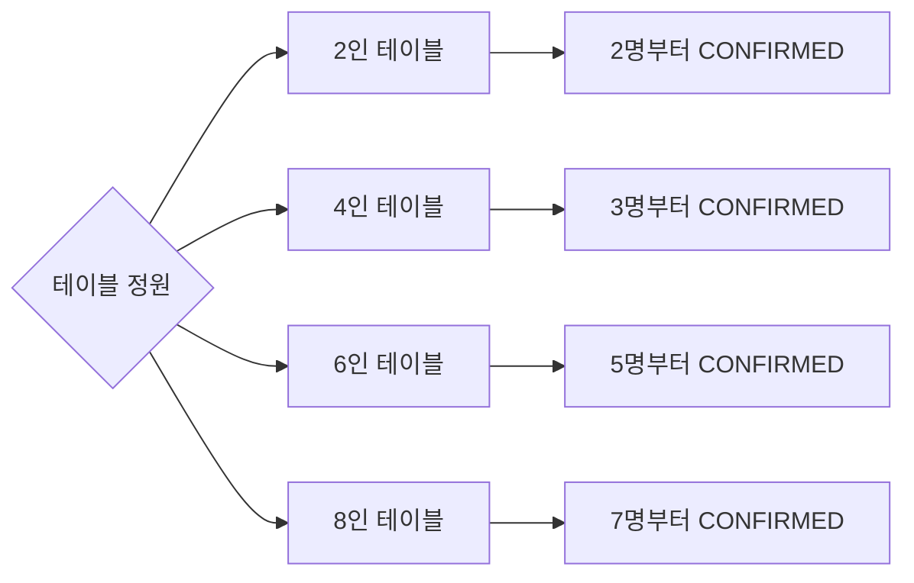
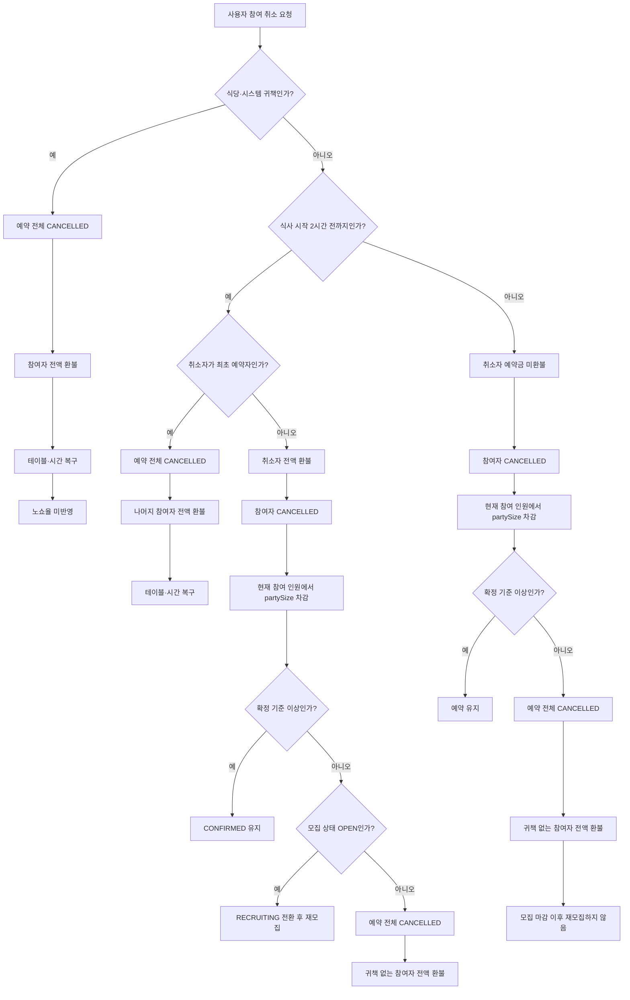
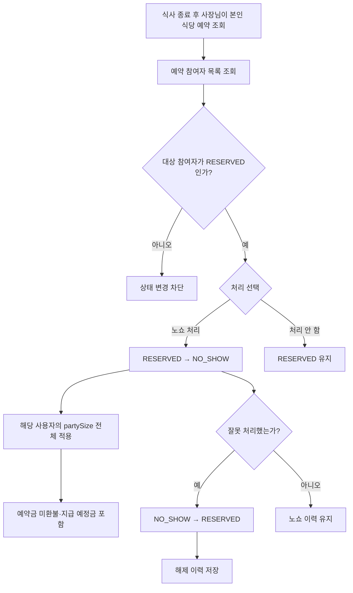
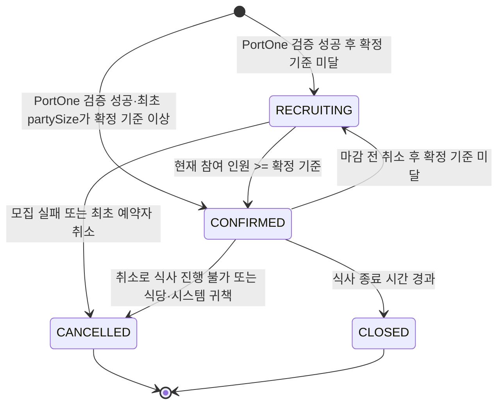
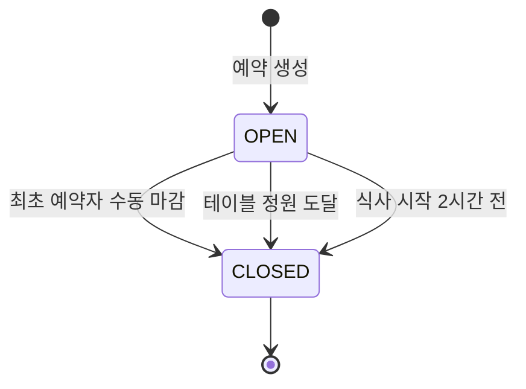
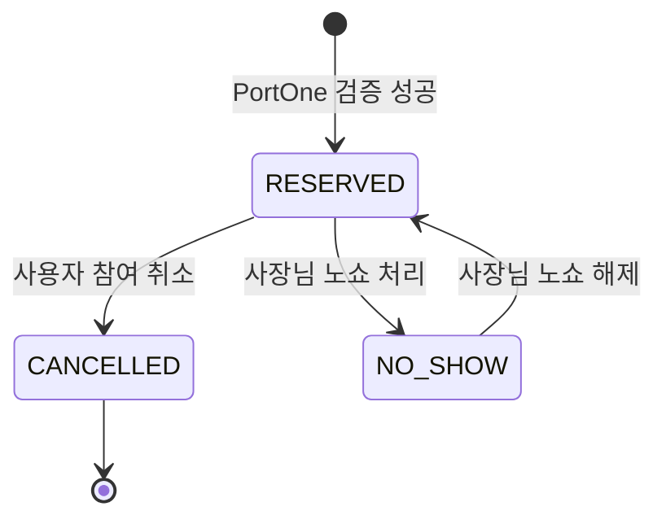
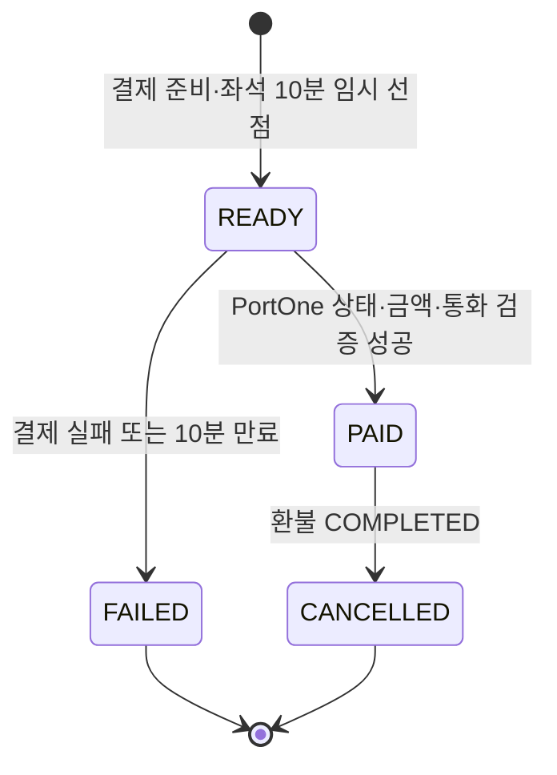

# 밥풀(BobFull) 전체 플로우차트

> 기준: 2026-07-23 최신 초기 기획  
> 정책 상세는 [`PROJECT_CONTEXT.md`](./PROJECT_CONTEXT.md)를 우선한다.  
> 상태 판단 기준은 참여 사용자 수가 아니라 결제 완료된 `partySize` 합계다.

## 1. 서비스 전체 흐름

```mermaid
flowchart TD
    START([밥풀 서비스 시작]) --> AUTH[회원가입 또는 로그인]
    AUTH --> ROLE{사용자 역할}

    ROLE -- 사장님 --> O1[본인 식당 등록·수정·조회]
    O1 --> O2[합석 테이블 등록]
    O2 --> O3[정원 선택: 2·4·6·8인]
    O3 --> O4[테이블별 예약 날짜·시작 시간 등록]
    O4 --> O5{동일 테이블·시간 중복인가?}
    O5 -- 예 --> OERR[회차 등록 실패]
    O5 -- 아니오 --> O6[예약 가능 회차 생성]

    ROLE -- 일반 사용자 --> U1[예약 가능한 식당·시간·테이블 조회]
    U1 --> PURPOSE{이용 목적}
    PURPOSE -- 최초 예약 --> N1[테이블과 partySize 선택]
    PURPOSE -- 추가 참여 --> J1[추가 참여 가능한 예약 조회]
    PURPOSE -- 내역 조회 --> M1[내 예약·결제 내역 조회]

    subgraph NEW[최초 예약 생성]
        N1 --> N2{partySize가 1 이상이고<br/>테이블 정원 이하인가?}
        N2 -- 아니오 --> NERR1[입력 검증 실패]
        N2 -- 예 --> N3{테이블·시간 예약 가능?}
        N3 -- 아니오 --> NERR2[중복 예약 생성 차단]
        N3 -- 예 --> N4{식사 시작 2시간 전보다 이전?}
        N4 -- 아니오 --> NERR3[모집 마감으로 생성 차단]
        N4 -- 예 --> N5[좌석 10분 임시 선점<br/>Payment READY·paymentId 생성]
        N5 --> N6[PortOne 예약금 결제]
        N6 --> N7{서버 결제 상태·금액·통화 검증 성공?}
        N7 -- 아니오 --> NERR4[Payment FAILED<br/>좌석 해제·예약 미생성]
        N7 -- 예 --> N8[Payment PAID<br/>예약과 최초 참여자 RESERVED 등록]
        N8 --> N9[현재 참여 인원에 partySize 합산]
        N9 --> N10[모집 상태 OPEN]
        N10 --> N11{테이블별 확정 기준 충족?}
        N11 -- 아니오 --> N12[예약 RECRUITING]
        N11 -- 예 --> N13[예약 CONFIRMED]
    end

    subgraph JOIN[추가 참여]
        J1 --> J2[예약 상세·현재 참여 인원·남은 인원 조회]
        J2 --> J3{추가 참여 조건 충족?}
        J3 -- 아니오 --> JERR1[추가 참여 차단]
        J3 -- 예 --> J4[partySize 입력]
        J4 --> J5{1 이상이고 남은 인원 이하?}
        J5 -- 아니오 --> JERR2[인원 검증 실패]
        J5 -- 예 --> J6{동일 사용자 중복 참여?}
        J6 -- 예 --> JERR3[중복 참여 차단]
        J6 -- 아니오 --> J7[좌석 10분 임시 선점<br/>Payment READY·paymentId 생성]
        J7 --> J8[PortOne 예약금 결제]
        J8 --> J9{서버 결제 검증 성공?}
        J9 -- 아니오 --> JERR4[Payment FAILED<br/>좌석 해제·참여자 미등록]
        J9 -- 예 --> J10[Payment PAID<br/>추가 참여자 RESERVED 등록]
        J10 --> J11[현재 참여 인원에 partySize 합산]
        J11 --> J12{테이블별 확정 기준 충족?}
        J12 -- 아니오 --> J13[RECRUITING 유지 또는 전환]
        J12 -- 예 --> J14[CONFIRMED 유지 또는 전환]
        J13 --> J15{테이블 정원 도달?}
        J14 --> J15
        J15 -- 예 --> J16[모집 상태 CLOSED]
        J15 -- 아니오 --> J17[모집 상태 OPEN 유지]
    end

    J3 -.-> JCOND["추가 참여 조건<br/>예약 RECRUITING 또는 CONFIRMED<br/>모집 OPEN<br/>시작 2시간 전 이전<br/>현재 참여 인원 < 정원"]

    N12 --> DEADLINE
    N13 --> CONFIRM_ACTION
    J17 --> CONFIRM_ACTION

    CONFIRM_ACTION{예약 CONFIRMED인가?} -- 예 --> HOST_CLOSE{최초 예약자가 모집 마감?}
    HOST_CLOSE -- 예 --> HC1[모집 상태 CLOSED<br/>다시 열기 불가]
    HOST_CLOSE -- 아니오 --> DEADLINE[모집 계속]
    CONFIRM_ACTION -- 아니오 --> DEADLINE

    DEADLINE --> D1{식사 시작 2시간 전 도달?}
    D1 -- 아니오 --> WAIT[추가 참여 대기]
    WAIT --> J1
    D1 -- 예 --> D2[모집 상태 CLOSED]
    D2 --> D3{테이블별 확정 기준 충족?}
    D3 -- 아니오 --> D4[예약 전체 CANCELLED]
    D4 --> D5[참여자 전액 환불]
    D5 --> D6[테이블·시간 복구]
    D3 -- 예 --> D7[CONFIRMED 유지]

    D7 --> MEAL[식사 진행]
    HC1 --> MEAL
    J16 --> MEAL
    MEAL --> END_TIME[식사 종료 시간 경과]
    END_TIME --> CLOSED[예약 CLOSED]
    CLOSED --> NOSHOW[사장님 참여자별 노쇼 처리·해제]
    NOSHOW --> SETTLEMENT[지급 예정 예약금 조회]
```

## 2. 테이블별 확정 기준

## 3. 취소·환불 흐름

## 4. 노쇼 처리·해제 흐름

## 5. 상태 관계

