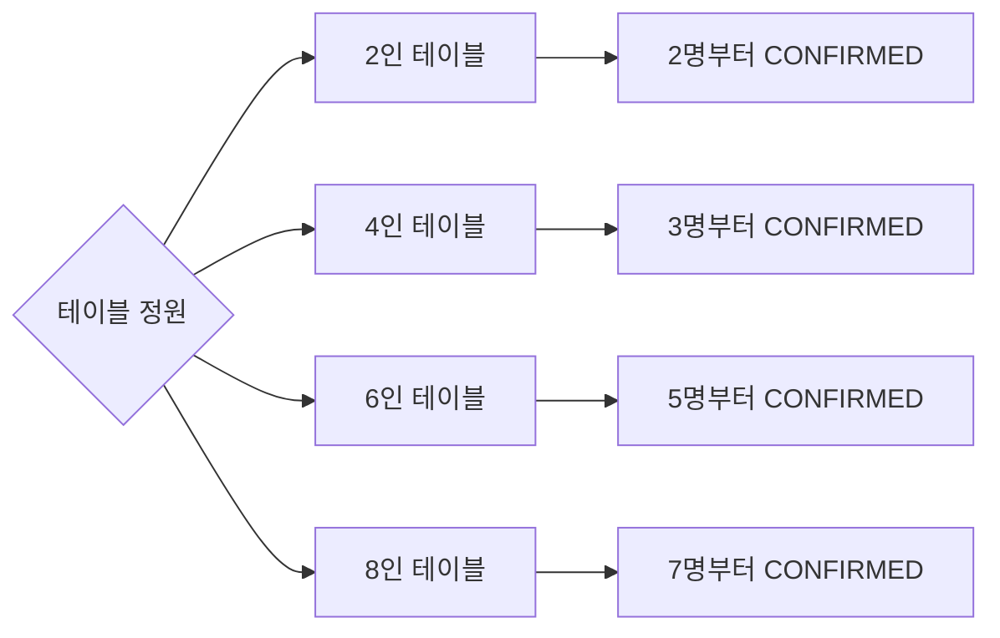
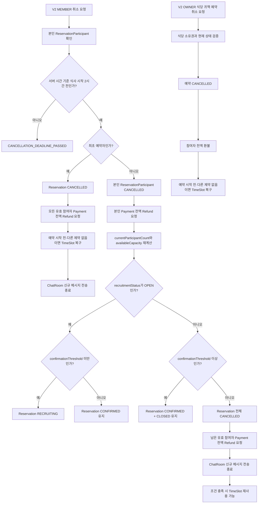
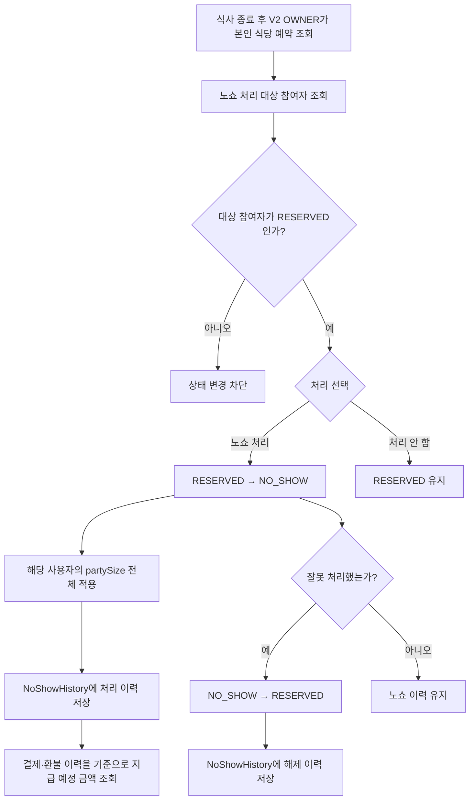
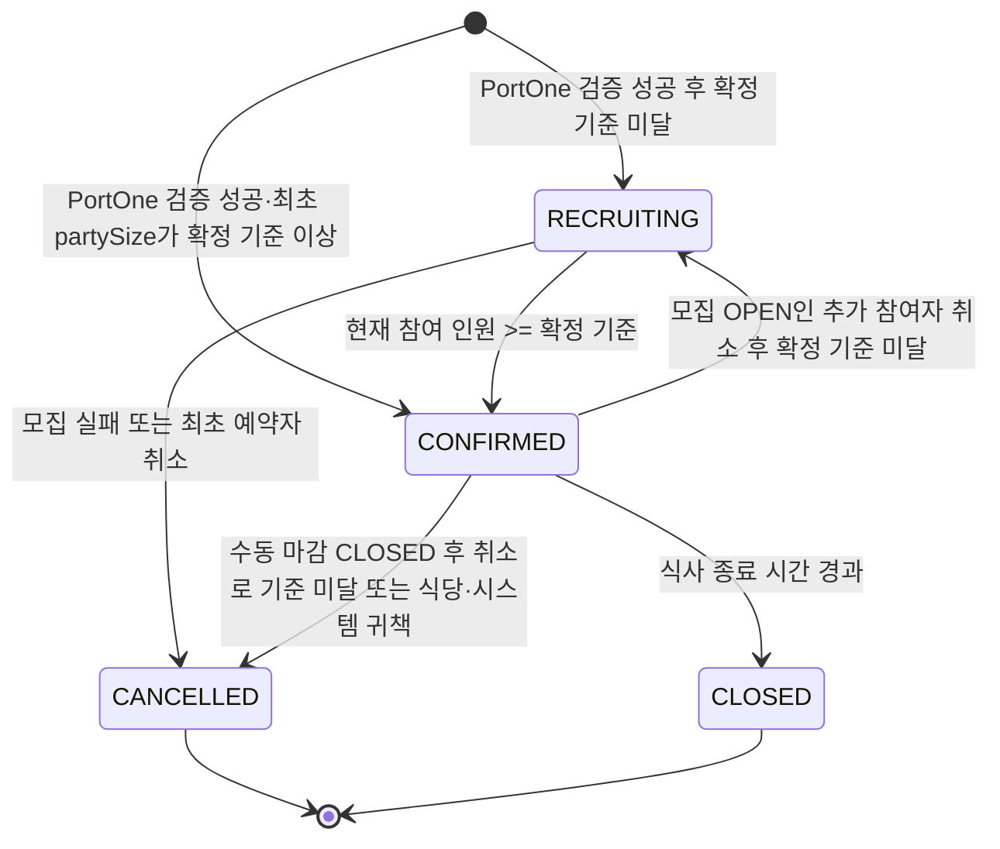
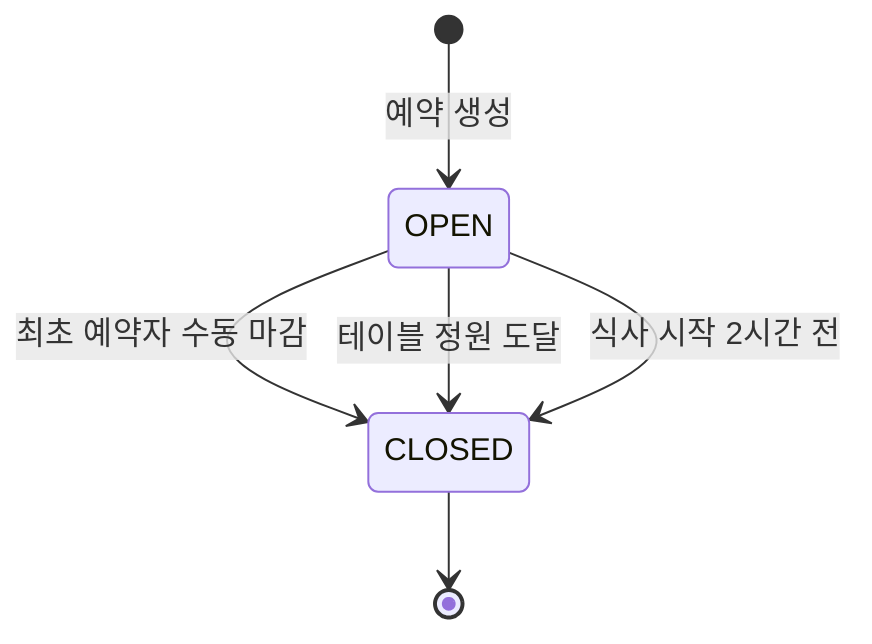
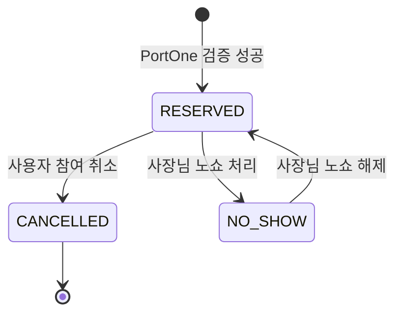
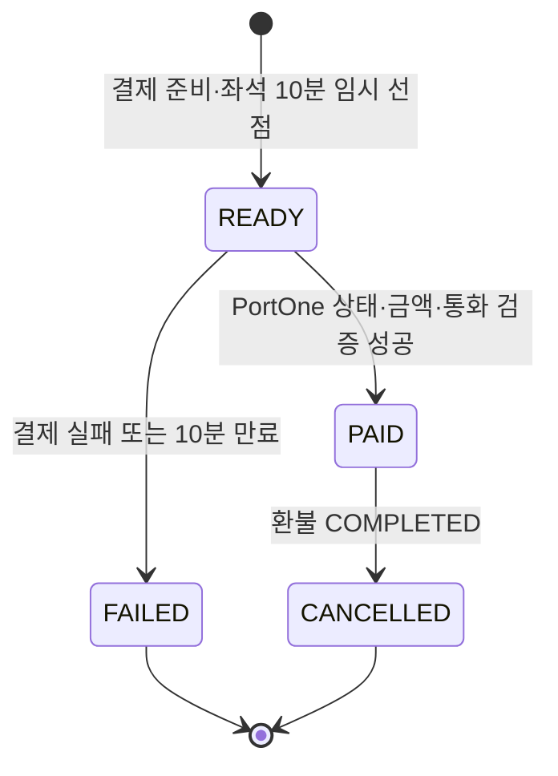

# 밥풀(BobFull) 전체 플로우차트

> 기준: [`BOBFULL_API_SPEC_COMPLETE.md`](./BOBFULL_API_SPEC_COMPLETE.md), [`PROJECT_CONTEXT.md`](./PROJECT_CONTEXT.md), [`ERD.md`](./ERD.md)
>
> 정책 상세는 API 명세와 PROJECT_CONTEXT를 우선한다.
> 상태 판단 기준은 참여 사용자 수가 아니라 결제 완료된 `partySize` 합계다.

## 1. 서비스 전체 흐름

```mermaid
flowchart TD
    START([밥풀 서비스 시작]) --> AUTH[회원가입 또는 로그인]
    AUTH --> ROLE{"사용자 역할"}

    ROLE -- OWNER --> O1[본인 식당 등록·수정·조회]
    O1 --> O2[합석 테이블 등록]
    O2 --> O3[정원 선택: 2·4·6·8인]
    O3 --> O4[테이블별 예약 날짜·시작 시간 등록]
    O4 --> O5{동일 테이블·시간 중복인가?}
    O5 -- 예 --> OERR[회차 등록 실패]
    O5 -- 아니오 --> O6[예약 가능 회차 생성]

    ROLE -- MEMBER --> U1[예약 가능한 식당·시간·테이블 조회]
    U1 --> PURPOSE{이용 목적}
    PURPOSE -- 최초 예약 --> N1[테이블과 partySize 선택]
    PURPOSE -- 추가 참여 --> J1[추가 참여 가능한 예약 조회]
    PURPOSE -- 내역 조회 --> M1[내 예약·결제 내역 조회]

    ROLE -- ADMIN --> A1[V2 운영 현황·통계 조회]
    A1 --> A2[V3 실패 결제·환불 재처리와 재집계]

    subgraph NEW[최초 예약 생성]
        N1 --> N2{partySize가 1 이상이고<br/>테이블 정원 이하인가?}
        N2 -- 아니오 --> NERR1[입력 검증 실패]
        N2 -- 예 --> N3{테이블·시간 예약 가능?}
        N3 -- 아니오 --> NERR2[중복 예약 생성 차단]
        N3 -- 예 --> N4{식사 시작 2시간 전보다 이전?}
        N4 -- 아니오 --> NERR3[모집 마감으로 생성 차단]
        N4 -- 예 --> N5[좌석 10분 임시 선점<br/>Payment READY·paymentId 생성]
        N5 --> N6[PortOne 예약금 결제]
        N6 --> N7{"인증 사용자와 Payment member가 일치하고 서버 결제 검증이 성공하는가"}
        N7 -- 아니오 --> NERR4[Payment FAILED<br/>좌석 해제·예약 미생성]
        N7 -- 예 --> N8[Payment PAID<br/>예약과 최초 참여자 RESERVED 등록]
        N8 --> N9[PAID 참여 인원과 availableCapacity 재계산]
        N9 --> N10[모집 상태 OPEN]
        N10 --> N11{테이블별 확정 기준 충족?}
        N11 -- 아니오 --> N12[예약 RECRUITING]
        N11 -- 예 --> N13[예약 CONFIRMED]
    end

    subgraph JOIN[추가 참여]
        J1 --> J2[예약 상세·현재 참여 인원·남은 인원 조회]
        J2 -.-> JCALC["availableCapacity = capacity - PAID 참여 인원 - 만료 전 READY 선점 인원"]
        J2 --> J3{추가 참여 조건 충족?}
        J3 -- 아니오 --> JERR1[추가 참여 차단]
        J3 -- 예 --> J4[partySize 입력]
        J4 --> J5{1 이상이고 남은 인원 이하?}
        J5 -- 아니오 --> JERR2[인원 검증 실패]
        J5 -- 예 --> J6{동일 사용자 중복 참여?}
        J6 -- 예 --> JERR3[중복 참여 차단]
        J6 -- 아니오 --> J7[좌석 10분 임시 선점<br/>Payment READY·paymentId 생성]
        J7 --> J8[PortOne 예약금 결제]
        J8 --> J9{"인증 사용자와 Payment member가 일치하고 서버 결제 검증이 성공하는가"}
        J9 -- 아니오 --> JERR4[Payment FAILED<br/>좌석 해제·참여자 미등록]
        J9 -- 예 --> J10[Payment PAID<br/>추가 참여자 RESERVED 등록]
        J10 --> J11[PAID 참여 인원과 availableCapacity 재계산]
        J11 --> J12{테이블별 확정 기준 충족?}
        J12 -- 아니오 --> J13[RECRUITING 유지 또는 전환]
        J12 -- 예 --> J14[CONFIRMED 유지 또는 전환]
        J13 --> J15{테이블 정원 도달?}
        J14 --> J15
        J15 -- 예 --> J16[예약 CONFIRMED·모집 CLOSED]
        J15 -- 아니오 --> J17[모집 상태 OPEN 유지]
    end

    J3 -.-> JCOND["추가 참여 조건<br/>예약 RECRUITING 또는 CONFIRMED<br/>모집 OPEN<br/>시작 2시간 전 이전<br/>availableCapacity > 0"]

    WEBHOOK["PortOne 웹훅: 서명 검증·결제 상태 멱등 반영"] -.-> N7
    WEBHOOK -.-> J9

    N12 --> DEADLINE
    N13 --> CONFIRM_ACTION
    J17 --> CONFIRM_ACTION

    N8 --> CHAT1[V2 예약당 ChatRoom 1개 생성]
    CHAT1 --> CHAT2[결제 완료·미취소 유효 참여자만 접근]
    CHAT2 --> CHAT3[STOMP 전송·구독 또는 cursor 메시지 조회]
    CHAT3 --> CHAT4{예약이 CANCELLED 또는 CLOSED인가?}
    CHAT4 -- 아니오 --> CHAT3
    CHAT4 -- 예 --> CHAT5[신규 메시지 전송 종료·기존 메시지 조회 가능]
    CHAT2 -.-> CHAT6[CANCELLED 참여자는 즉시 접근 종료]

    CONFIRM_ACTION{예약 CONFIRMED인가?} -- 예 --> HOST_CLOSE{최초 예약자가 수동 마감을 요청했는가?}
    HOST_CLOSE -- 예 --> HC_AUTH{최초 예약자인가?}
    HC_AUTH -- 아니오 --> HCERR1[ACCESS_DENIED]
    HC_AUTH -- 예 --> HC_OPEN{recruitmentStatus가 OPEN인가?}
    HC_OPEN -- 아니오 --> HCERR2[RECRUITMENT_ALREADY_CLOSED]
    HC_OPEN -- 예 --> HC1[모집 상태 CLOSED<br/>다시 열기 불가]
    HOST_CLOSE -- 아니오 --> DEADLINE[모집 계속]
    CONFIRM_ACTION -- 아니오 --> DEADLINE

    DEADLINE --> D1{식사 시작 2시간 전 도달?}
    D1 -- 아니오 --> WAIT[추가 참여 대기]
    WAIT --> J1
    D1 -- 예 --> D2[모집 상태 CLOSED]
    D2 --> D3{테이블별 확정 기준 충족?}
    D3 -- 아니오 --> D4[예약 전체 CANCELLED]
    D4 --> D5[참여자 전액 환불]
    D5 --> D6[테이블·시간 복구]
    D3 -- 예 --> D7[CONFIRMED 유지]

    D7 --> MEAL[식사 진행]
    HC1 --> MEAL
    J16 --> MEAL
    MEAL --> END_TIME[식사 종료 시간 경과]
    END_TIME --> CLOSED[예약 CLOSED]
    CLOSED --> NOSHOW[V2 OWNER 참여자별 노쇼 처리·해제·이력]
    NOSHOW --> SETTLEMENT[지급 예정 예약금 조회]
```

## 2. 테이블별 확정 기준

## 3. 취소·환불 흐름

## 4. 노쇼 처리·해제 흐름

## 5. 상태 관계

