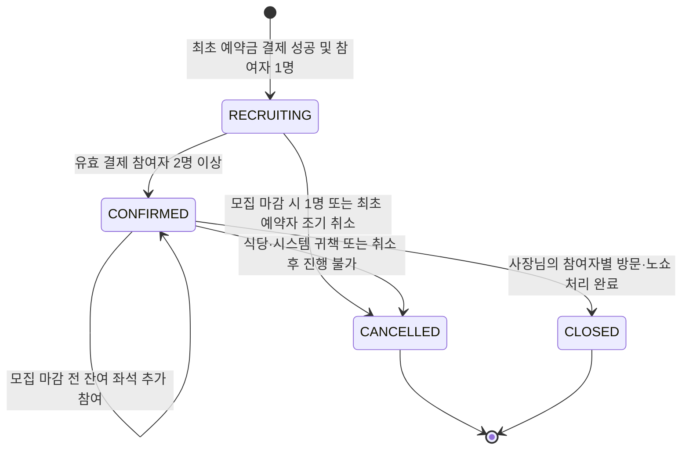
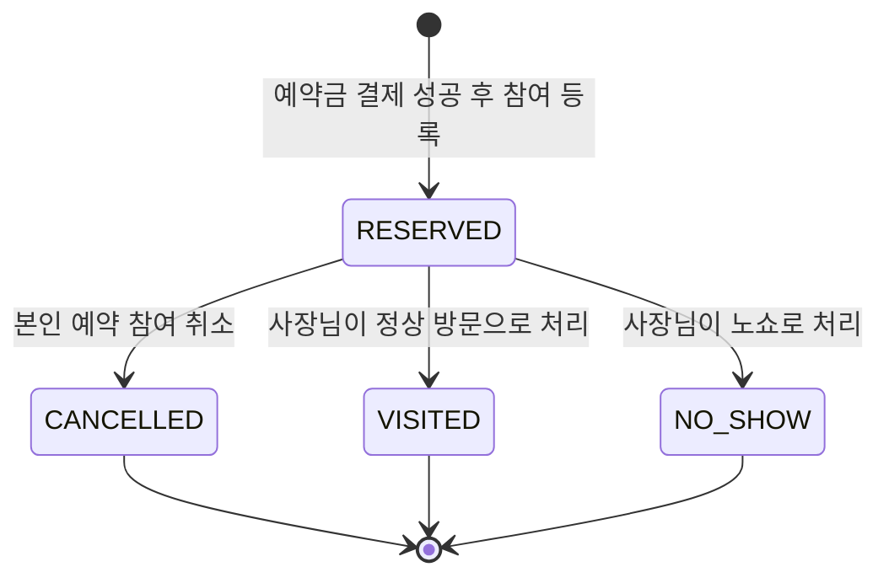
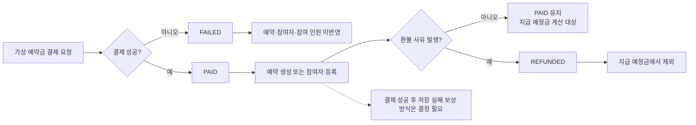
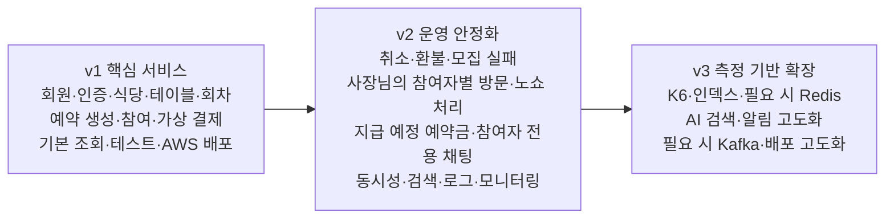

# 밥풀(BobFull) 전체 플로우차트

> 기준: 2026-07-22 최신 프로젝트 확정 컨텍스트
>
> 표기: 파랑 = v1, 주황 = v2, 보라 = v3, 빨강 점선 = 결정 필요
>
> 이 문서는 전체 흐름을 보여주는 산출물이다. 정책 상세는 최신 프로젝트 확정 컨텍스트를 우선하며, 도메인 변경 영향은 [`DOMAIN_DEPENDENCIES.md`](./DOMAIN_DEPENDENCIES.md)를 확인한다.

## 1. 서비스 전체 업무 플로우

```mermaid
flowchart TD
    START([밥풀 서비스 시작]) --> AUTH[회원가입 또는 로그인]
    AUTH --> AUTH_OK{인증 성공?}
    AUTH_OK -- 아니오 --> AUTH_FAIL[접근 차단 및 인증 오류]
    AUTH_FAIL --> AUTH
    AUTH_OK -- 예 --> ROLE{사용자 권한}

    subgraph OWNER[사장님 흐름]
        direction TD
        O1[본인 식당 등록·조회·수정] --> O2[합석 테이블 등록]
        O2 --> O3[테이블 정원 선택<br/>2인·4인·8인]
        O3 --> O4[테이블별 예약 날짜·시작 시간 등록]
        O4 --> O5{동일 테이블·시간이<br/>이미 등록되었는가?}
        O5 -- 예 --> O_ERR[중복 회차 등록 실패]
        O5 -- 아니오 --> O6[예약 가능 회차 생성]
        O6 --> O7[예약 시간별 테이블·참여 현황 조회]
        O7 --> O8[현재 참여 인원·남은 참여 가능 인원 조회]
        O8 --> O9[본인 식당만 관리 가능]
    end

    ROLE -- 사장님 --> O1

    subgraph USER[일반 사용자 예약 흐름]
        direction TD
        U1[식당 목록·상세 조회] --> U2[예약 가능한 날짜·시간·테이블 조회]
        U2 --> U3{사용 목적}
        U3 -- 새 합석 모집 시작 --> N1[식당·날짜·시간·테이블 선택]
        U3 -- 기존 합석 참여 --> J1[추가 참여 가능한 예약 조회]
        U3 -- 내역 확인 --> M1[내 예약·결제 내역 조회]
    end

    ROLE -- 일반 사용자 --> U1

    subgraph NEW_RESERVATION[최초 예약 생성 · v1]
        direction TD
        N1 --> N2{테이블·회차가<br/>예약 가능한가?}
        N2 -- 아니오 --> N_FAIL1[예약 생성 실패]
        N2 -- 예 --> N3{식사 시작 2시간 전보다<br/>이전인가?}
        N3 -- 아니오 --> N_FAIL2[모집 마감으로 생성 차단]
        N3 -- 예 --> N4[본인 1명분 가상 예약금 결제]
        N4 --> N5{결제 성공?}
        N5 -- 아니오 --> N_FAIL3[결제 FAILED<br/>예약·참여자·인원 미반영]
        N5 -- 예 --> N6[결제 PAID]
        N6 --> N7[합석 예약과 최초 참여자 등록]
        N7 --> N8[참여자 상태 RESERVED]
        N8 --> N9[유효 참여 인원 1명]
        N9 --> N10[예약 상태 RECRUITING]
        N10 --> N11[동일 테이블·시간의<br/>중복 합석 예약 생성 차단]
    end

    subgraph JOIN_RESERVATION[추가 참여 · v1]
        direction TD
        J1 --> J2[예약 상세 조회]
        J2 --> J3{추가 참여 조건 충족?}
        J3 -- 아니오 --> J_FAIL1[참여 차단]
        J3 -- 예 --> J4[본인 1명분 가상 예약금 결제]
        J4 --> J5{결제 성공?}
        J5 -- 아니오 --> J_FAIL2[결제 FAILED<br/>참여자·인원 미반영]
        J5 -- 예 --> J6[결제 PAID]
        J6 --> J7[추가 참여자 RESERVED 등록]
        J7 --> J8[유효 참여 인원 + 1]
        J8 --> J9{현재 참여 인원}
        J9 -- 1명 --> J10[RECRUITING 유지]
        J9 -- 2명 이상 --> J11[CONFIRMED 전환 또는 유지]
        J10 --> J12{테이블 정원 도달?}
        J11 --> J12
        J12 -- 아니오 --> J13[모집 마감 전까지 추가 참여 허용]
        J12 -- 예 --> J14[남은 참여 가능 인원 0명<br/>추가 참여 차단]
    end

    J3 -.-> JCOND["참여 조건<br/>RECRUITING 또는 CONFIRMED<br/>현재 시각이 시작 2시간 전보다 이전<br/>유효 참여 인원이 테이블 정원보다 적음"]

    subgraph DEADLINE[식사 시작 2시간 전 모집 마감 · v2]
        direction TD
        D1[시스템이 모집 마감 대상 예약 처리] --> D2{유효 참여 인원}
        D2 -- 1명 --> D3[예약 전체 CANCELLED]
        D3 --> D4[남은 참여자 예약금 전액 환불]
        D4 --> D5[참여자 CANCELLED]
        D5 --> D6[테이블·시간 예약 가능 복구]
        D2 -- 2명 이상 --> D7[CONFIRMED 유지]
        D7 --> D8[추가 참여 모집 종료]
        D8 --> D9[마감 이후 빈자리가 생겨도 재모집하지 않음]
    end

    N11 --> D1
    J13 --> D1
    J14 --> D1

    subgraph CANCELLATION[예약 참여 취소·환불 · v2]
        direction TD
        C1[사용자가 본인 예약 참여 취소 요청] --> C2{식당·시스템 귀책으로<br/>진행 불가한가?}
        C2 -- 예 --> CS1[예약 전체 CANCELLED]
        CS1 --> CS2[참여자 전원 전액 환불]
        CS2 --> CS3[노쇼율 미반영]
        CS3 --> CS4[테이블·시간 예약 가능 복구]

        C2 -- 아니오 --> C3{식사 시작 2시간 전까지인가?}
        C3 -- 예 --> C4{취소자가 최초 예약자인가?}
        C4 -- 예 --> C5[예약 전체 CANCELLED]
        C5 --> C6[모든 참여자 전액 환불]
        C6 --> C7[모든 참여자 CANCELLED]
        C7 --> C8[테이블·시간 예약 가능 복구]

        C4 -- 아니오 --> C9[취소자 전액 환불]
        C9 --> C10[취소자 CANCELLED]
        C10 --> C11[유효 참여 인원 재계산]
        C11 --> C12{남은 참여 인원}
        C12 -- 2명 이상 --> C13[CONFIRMED 유지]
        C12 -- 1명 --> C14[RECRUITING 전환]
        C14 --> C15[모집 마감 전까지 재모집]
        C15 --> D1

        C3 -- 아니오 --> C16{취소자가 최초 예약자인가?}
        C16 -- 예 --> PENDING_CANCEL[2시간 이후 최초 예약자 취소<br/>팀 결정 필요]
        C16 -- 아니오 --> C17[개인 사유 취소 허용]
        C17 --> C18[취소자 예약금 미환불]
        C18 --> C19[미환불 예약금을 지급 예정금에 포함]
        C19 --> C20[취소자 CANCELLED]
        C20 --> C21[유효 참여 인원 재계산]
        C21 --> C22{남은 참여 인원}
        C22 -- 2명 이상 --> C23[예약 유지]
        C22 -- 2명 미만 --> C24[예약 전체 CANCELLED]
        C24 --> C25[귀책 없는 참여자 전액 환불]
        C25 --> C26[마감 이후 재모집하지 않음]
    end

    M1 --> C1
    N11 --> C1
    J11 --> C1

    subgraph CHAT[예약 참여자 전용 채팅 · v2]
        direction TD
        CH1[로그인 사용자 채팅방 접근 요청] --> CH2{해당 예약의 최초 예약자 또는<br/>유효한 참여자인가?}
        CH2 -- 아니오 --> CH_FAIL[입장·조회·전송 차단]
        CH2 -- 예 --> CH3[예약 전용 채팅방 입장]
        CH3 --> CH4[메시지 조회·전송 시<br/>참여 관계 재검증]
        CH4 --> CH5[사장님·관리자·비참여자 접근 불가]
        CH3 -.-> PENDING_CHAT["결정 필요<br/>채팅방 생성 시점<br/>RECRUITING 접근 여부<br/>취소·종료 후 권한<br/>저장·보관 기간"]
    end

    N8 --> CH1
    J7 --> CH1

    subgraph VISIT[사장님 방문·노쇼 처리 · v2]
        direction TD
        V1[사장님이 본인 식당 예약 조회] --> V2[예약 참여자 목록 조회]
        V2 --> V3{대상 참여자가 RESERVED인가?}
        V3 -- 아니오 --> V_FAIL[상태 변경 차단]
        V3 -- 예 --> V4{처리 결과 선택}
        V4 -- 정상 방문 --> V5[RESERVED → VISITED]
        V4 -- 노쇼 --> V6[RESERVED → NO_SHOW]
        V6 --> V7[예약금 미환불 및 지급 예정금 포함]
        V5 --> V8{모든 유효 참여자 처리가<br/>완료되었는가?}
        V6 --> V8
        V8 -- 아니오 --> V2
        V8 -- 예 --> V9[예약 CLOSED 전환]
        V8 -.-> PENDING_VISIT["결정 필요<br/>처리 시작·마감 시간<br/>잘못된 상태 정정<br/>미처리 참여자 기본 처리<br/>CLOSED 전환 방식"]
    end

    D7 --> V1
    C13 --> V1
    C23 --> V1

    subgraph SETTLEMENT[지급 예정 예약금 · v2]
        direction TD
        S1[결제·환불·취소·방문·노쇼 결과 집계] --> S2[지급 예정 예약금 계산]
        S2 --> S3[PAID 금액 합계 - REFUNDED 금액 합계]
        S3 --> S4[포함: VISITED·NO_SHOW·마감 이후 미환불 취소]
        S4 --> S5[제외: 모집 실패·식당 귀책·시스템 귀책·귀책 없는 참여자 환불]
        S5 --> S6[사장님이 지급 예정 예약금 조회]
        S6 --> S7[실제 계좌 송금·POS 정산은 구현하지 않음]
    end

    V9 --> S1
    C19 --> S1
    CS2 --> S1
    D4 --> S1

    subgraph ADMIN[관리자 최소 기능 · v2]
        direction TD
        A1[회원 현황 조회] --> A2[식당 현황 조회]
        A2 --> A3[예약 현황 조회]
        A3 --> A4[결제·환불 현황 조회]
        A4 --> A5[시스템 오류·비정상 처리 추적]
        A5 --> PENDING_ADMIN[제재·승인 상세 정책 보류]
    end

    ROLE -- 관리자 --> A1

    subgraph EXTENSION[v3 측정 기반 확장]
        direction TD
        X1[핵심 예약·결제 흐름 안정화] --> X2[K6 부하 테스트 및 RPS·P95·P99·에러율 측정]
        X2 --> X3[EXPLAIN·인덱스 개선]
        X3 --> X4{조회 병목이 측정되었는가?}
        X4 -- 예 --> X5[필요 시 Redis Cache-Aside]
        X4 -- 아니오 --> X6[Redis 도입하지 않음]
        X1 --> X7[자연어 식당·예약 검색 후보]
        X7 --> X8[실제 DB 검색 API Tool Calling]
        X8 --> X9[AI 타임아웃·오류 Fallback]
        X1 --> X10[예약·참여·확정·취소 알림 고도화]
        X10 --> X11[SSE 또는 WebSocket 검토]
        X11 --> X12[우선 Spring Event 적용]
        X12 --> X13{외부 브로커 필요성이<br/>실제로 확인되었는가?}
        X13 -- 예 --> X14[Kafka 검토·Consumer 멱등성·재처리]
        X13 -- 아니오 --> X15[Spring Event 유지]
        X1 --> X16[측정 근거에 따라 무중단 배포 또는 오토스케일링 중 하나 선택]
    end

    S7 --> X1

    subgraph PENDING[추가 결정 필요]
        direction TD
        P1[결제 성공 후 예약·참여 저장 실패 보상]
        P2[마지막 자리 동시 결제 결과]
        P3[동일 사용자의 동일 시간대 중복 참여]
        P4[실제 환불 처리 방식]
        P5[테이블 회전 시간·휴무 관리]
    end

    N6 -.-> P1
    J6 -.-> P1
    J12 -.-> P2
    J3 -.-> P3
    C9 -.-> P4
    O4 -.-> P5

    classDef v1 fill:#E8F1FF,stroke:#2563EB,stroke-width:1.5px,color:#111827;
    classDef v2 fill:#FFF4E5,stroke:#F59E0B,stroke-width:1.5px,color:#111827;
    classDef v3 fill:#F3E8FF,stroke:#9333EA,stroke-width:1.5px,color:#111827;
    classDef decision fill:#F8FAFC,stroke:#475569,stroke-width:1.5px,color:#111827;
    classDef state fill:#ECFDF5,stroke:#059669,stroke-width:1.5px,color:#111827;
    classDef error fill:#FEF2F2,stroke:#DC2626,stroke-width:1.5px,color:#991B1B;
    classDef pending fill:#FFF1F2,stroke:#E11D48,stroke-width:2px,stroke-dasharray:6 4,color:#9F1239;

    class AUTH,O1,O2,O3,O4,O5,O6,O7,O8,O9,U1,U2,U3,N1,N2,N3,N4,N5,N6,N7,N8,N9,N10,N11,J1,J2,J3,J4,J5,J6,J7,J8,J9,J10,J11,J12,J13,J14,M1 v1;
    class D1,D2,D3,D4,D5,D6,D7,D8,D9,C1,C2,C3,C4,C5,C6,C7,C8,C9,C10,C11,C12,C13,C14,C15,C16,C17,C18,C19,C20,C21,C22,C23,C24,C25,C26,CS1,CS2,CS3,CS4,CH1,CH2,CH3,CH4,CH5,V1,V2,V3,V4,V5,V6,V7,V8,V9,S1,S2,S3,S4,S5,S6,S7,A1,A2,A3,A4,A5 v2;
    class X1,X2,X3,X4,X5,X6,X7,X8,X9,X10,X11,X12,X13,X14,X15,X16 v3;
    class AUTH_OK,ROLE,O5,N2,N3,N5,J3,J5,J9,J12,D2,C2,C3,C4,C12,C16,C22,CH2,V3,V4,V8,X4,X13 decision;
    class N10,J10,J11,D7,V5,V6,V9 state;
    class AUTH_FAIL,O_ERR,N_FAIL1,N_FAIL2,N_FAIL3,J_FAIL1,J_FAIL2,CH_FAIL,V_FAIL error;
    class PENDING_CANCEL,PENDING_CHAT,PENDING_VISIT,PENDING_ADMIN,P1,P2,P3,P4,P5 pending;
    class JCOND decision;
```

## 2. 예약 상태 전이

`CLOSED` 전환의 구체적인 처리 시점과 미처리 참여자 기본값은 결정 필요 항목이다.

## 3. 참여자 상태 전이

방문 코드, 사용자 직접 체크인과 자동 노쇼 처리는 사용하지 않는다.

## 4. 결제 처리 흐름

> 결제 상태는 예약 전체의 단일 상태가 아니라 참여자별 결제 건의 결과다.

## 5. v1·v2·v3 구현 순서

채팅은 v2다. 최초 예약자와 해당 예약의 유효 참여자만 접근하며, 사장님·관리자·비참여자는 접근하지 않는다.
